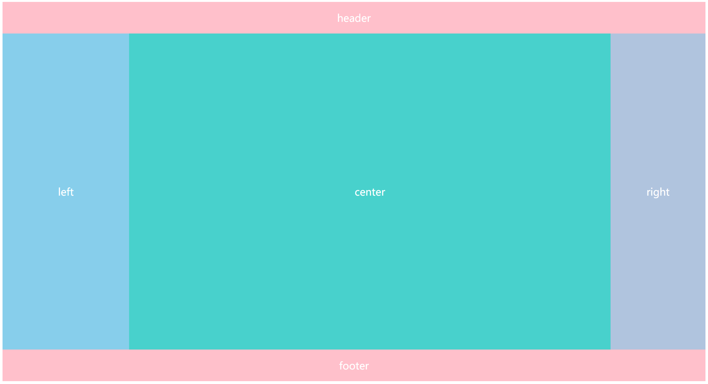
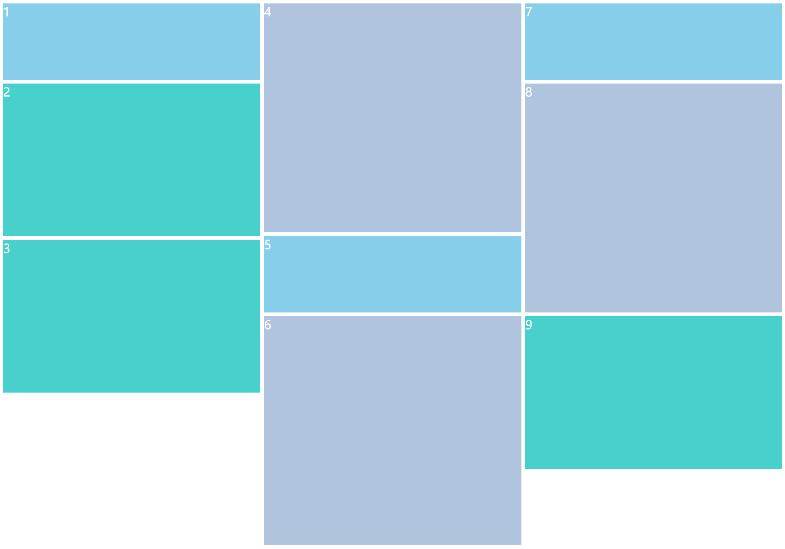

# 布局

[toc]

## 浏览器默认是如何布局的？

流布局是浏览器布局的基本方式。包括块布局和内联布局。

浏览器根据书写顺序`writing-mode`，决定块布局和内联布局方向

`horizontal-tb`是`writing-mode`默认值，也是中英文的常用书写顺序

块布局 的方向从上到下，即块**盒子从上到下换行，相邻块盒子的外边距折叠**

内联布局 的方向由文本、列表水平对齐方向direction决定

- 左对齐ltr时，内联盒子在同一行，从左到右排列
- 右对齐rtl时，内联盒子在同一行，从右到左排列

## 什么是弹性布局？

给父元素设置`display:flex`, 父元素表现为块盒子，开启弹性布局

给父元素设置`display:inline-flex`, 父元素表现为内联块盒子，开启弹性布局

区别于默认布局，弹性布局：

- 子元素成为弹性盒子，宽度、高度、外边距可以弹性变化，自适应父元素的尺寸
- 子元素可以在垂直、水平方向上，正向或反向排列
- 父元素通过[justify-content](https://developer.mozilla.org/zh-CN/docs/Web/CSS/justify-content)决定子元素在主轴的对齐方式
- 父元素通过[align-items](https://developer.mozilla.org/zh-CN/docs/Web/CSS/align-items)决定子元素在交叉轴的对齐方式
- 父元素通过[align-content](https://developer.mozilla.org/zh-CN/docs/Web/CSS/align-content)决定多行子元素整体在交叉轴的对齐方式
- 子元素通过[align-self](https://developer.mozilla.org/zh-CN/docs/Web/CSS/align-self)决定自身在交叉轴的对齐方式

## 什么是外边距折叠，如何避免？

- 上下相邻盒子的外边距没有累加而是重叠取其中的较大值，称之为外边距折叠

解决方法：增加内容，直接写入或使用伪元素

  ```css
  div:first-of-type {
    margin-bottom: 10px
  }
  div:nth-of-type(2) {
    margin-top: 10px;
    margin-bottom: 10px;
  }
  /*解决方法之1：通过伪元素增加内容*/
  div:nth-of-type(2)::before {
    content: '内容';
    display: block;
  }*/
  div:last-of-type {
    margin-top: 10px
  }
  ```

  ```html
  <!-- 中间的空DIV，只要上外边距<=10px，下外边距<=10px，都不影响1和3的实际间距 -->
  <div>1</div>
  <div><!-- 内容 解决方法之2：直接增加内容 --></div>
  <div>3</div>
  ```

- 没有触发BFC，边框，内边距和内容的父块盒子和子块盒子

  父块盒子的上边距 = 父块盒子的上边距 和 子块盒子的上边距的最大值

  父块盒子的下边距 = 父块盒子的下边距 和 子块盒子的下边距的最大值

  ``` html
  <style>
    .parent {
      margin-top: 10px;
      margin-bottom: 10px;
      /*overflow: hidden; 解决方法之1：触发BFC*/
      /*border: 1px solid black; 解决方法之2：设置边框*/
      /*paddding-top: 1px; 解决方法之3：设置内边距*/
    }
    .sub {
      margin-top: 10px;
      margin-bottom: 10px;
    }
  </style>
  
  <!-- 父块盒子和子块盒子的上外边距都是10px，下外边距都是10px -->
  <div class="parent">
    <!-- <div>内容</div> 解决方法之4：增加内容 -->
    <div class="sub"></div>
  </div>
  ```

  解决方法：

  - 设置边框
  - 设置内边距
  - 增加内容，直接写入或使用伪元素
  - 其他触发BFC的方法都可以

## 什么是块级格式上下文？

### 定义

[块格式化上下文](https://developer.mozilla.org/zh-CN/docs/Web/Guide/CSS/Block_formatting_context)，英文全称Block Formatting Context

它声明了一块布局区域，浏览器对区域内盒子按照一定方式布局，包括默认布局、弹性布局flex、网格布局grid、表格布局等

- 默认布局时，区域高度包括浮动元素高度
- 不同区域相互独立，区域内的盒子和区域外的盒子互不影响
- 不同区域不会发生边框折叠

### 规则

- 属于同一个 BFC 的两个相邻 Box 垂直排列
- 属于同一个 BFC 的两个相邻 Box 的 margin 会发生重叠
- BFC 中子元素的 margin box 的左边， 与包含块 (BFC) border box的左边相接触 (子元素 absolute 除外)
- BFC 的区域不会与 float 的元素区域重叠
- 计算 BFC 的高度时，浮动子元素也参与计算
- 文字层不会被浮动层覆盖，环绕于周围

### 触发条件

我们可以根据布局、溢出处理和有限布局，用不同的方法创建块级格式上下文

- 根元素（`<html>`）
- 浮动元素（元素的 float 不是 none）
- 绝对定位元素（元素的 position 为 absolute 或 fixed）
- 行内块元素（元素的 display 为 inline-block）
- 表格单元格（元素的 display 为 table-cell，HTML表格单元格默认为该值）
- 表格标题（元素的 display 为 table-caption，HTML表格标题默认为该值）
- 匿名表格单元格元素（元素的 display 为 table、table-row、 table-row-group、table-header-group、table-footer-group（分别是HTML table、row、tbody、thead、tfoot 的默认属性）或 inline-table）
- overflow 计算值(Computed)不为 visible 的块元素
- display 值为 flow-root 的元素
- contain 值为 layout、content 或 paint 的元素
- 弹性元素（display 为 flex 或 inline-flex 元素的直接子元素）
- 网格元素（display 为 grid 或 inline-grid 元素的直接子元素）
- 多列容器（元素的 column-count 或 column-width (en-US) 不为 auto，包括 column-count 为 1）
- column-span 为 all 的元素始终会创建一个新的BFC，即使该元素没有包裹在一个多列容器中（标准变更，Chrome bug）

### 用途

- 清除浮动；
- 解决外边框折叠；
- 自适应两栏布局；
- 限定布局范围提高渲染性能

## 有哪些定位方式？

- 静态定位:static
- 相对定位:relative
  - 创建BFC和定位上下文
  - 当z-index不为auto时，创建折叠上下文
- 绝对定位absolute
  - 创建BFC和定位上下文
  - 当z-index不为auto时，创建折叠上下文
- 固定定位:fixed，相对transfrom:perspective和filter不为none的最近父元素，没有视窗
  - 创建BFC和定位上下文
  - 创建层叠上下文
- 粘性定位：sticky
  - 创建定位上下文
  - 创建层叠上下文
  - 滚动最近overflow不为visible父元素
    - 未被卷曲：表现为未创建BFC的相对定位
    - 将被卷曲：表现为绝对定位

## 什么是定位上下文？

position不为static时，可以通过top right bottom left设置元素位置偏移量，并且不会影响其它元素的位置

定位上下文，决定元素相对于哪个父元素偏移

非静态定位元素，设置偏移量后

- 相对于最近的非静态定位的父元素偏移
- 没有，则相对于根元素`<html>`的父级，即视窗偏移

可以给父元素设置position不为static改变定位上下文，决定子元素相对于谁偏移

其中`position:relative`对父元素的副作用最小

子绝父相常用于组件内部的绝对定位，而不影响组件外元素的位置关系

## 什么是层叠上下文？

定义：层叠上下文是元素在Z轴上的层次关系集合并影响渲染顺序，改变z-index的值可以改变position为static的元素的层叠顺序

层叠上下文中元素层级影响子元素的层级，兄弟元素间的层级由z-index影响

创建：

- 文档根元素（`<html>`）；
- position 值为 absolute（绝对定位）或  relative（相对定位）且 z-index 值不为 auto 的元素；
- position 值为 fixed（固定定位）或 sticky（粘滞定位）的元素（沾滞定位适配所有移动设备上的浏览器，但老的桌面浏览器不支持）；
- flex (flexbox) 容器的子元素，且 z-index 值不为 auto；
- grid (grid) 容器的子元素，且 z-index 值不为 auto；
- opacity 属性值小于 1 的元素（参见 the specification for opacity）；
- [mix-blend-mode](https://developer.mozilla.org/zh-CN/docs/Web/CSS/mix-blend-mode) 属性值不为 normal 的元素；
- 以下任意属性值不为 none 的元素：
  - transform
  - filter
  - perspective
  - clip-path
  - mask / mask-image / mask-border
- isolation 属性值为 isolate 的元素；
- -webkit-overflow-scrolling 属性值为 touch 的元素；
- will-change 值设定了任一属性而该属性在 non-initial 值时会创建层叠上下文的元素（参考这篇文章）；
- contain 属性值为 layout、paint 或包含它们其中之一的合成值（比如 contain: strict、contain: content）的元素。

用途：

- 改善兼容性
  - 解决遮挡问题
  - 解决滚动穿透问题
- 提升移动端体验
  - 如通过-webkit-overflow-scrolling: touch增加滚动回弹效果
- 性能优化：频繁变化的内容单独一层放置

## 什么是浮动，如何清除浮动？

定义：默认布局流中，浮动元素脱离文档流，沿内联布局的开始或结束位置放置；与绝对定位或者固定定位不同、浮动元素的宽高、内边距和边框，依然影响相邻元素的位置，相邻元素环绕浮动元素流式布置

创建：

- float不为none时创建浮动元素(left | right | none | inline-start | inline-end)
- 弹性布局的父元素不能浮动

清除浮动：浮动元素脱离文档流，只包含浮动元素的父元素高度为0，带来问题：

- 父元素的高度不会随内容高度变化，内外边距、边框和背景无法自适应内容
- 父元素后的元素与父元素内的浮动元素重叠
- 父元素后的元素外边距属性无效

解决问题的思路：

- 设置高度
  - 通过JS将父元素高度设为获取浮动元素的最大高度
  - 通过CSS将父元素高度height设置固定值，然后设置溢出属性overflow，裁剪超出高度的部分或添加滚动条
- 清除浮动：
  - 通过HTML在父元素内部末尾添加清除浮动元素
    - 通过CSS元素在父元素内部末尾添加清除浮动的伪元素

    ```html
    <style>
    .box > div {
      float: left;
      width: 33.33%;
    }
    .clearfix {
     clear: both;
    }
    .margin-top {
      margin-top: 10px;
    }
    </style>
    <div class="box">
      <div></div>
      <div></div>
      <div></div>
      <div class="clearfix"></div>
      </div>
    <div class="margin-top"></div>
    ```

    - 通过HTML在父元素下边添加清除浮动的元素(解决外边框问题)

    ```html
    <style>
    .box > div {
      float: left;
      width: 33.33%;
    }
    .clearfix {
     clear: both;
    }
    .margin-top {
     margin-top: 10px;
    }
    </style>
    <div class="box">
      <div></div>
      <div></div>
      <div></div>
      </div>
      <div class="clearfix"></div>
    <div class="margin-top"></div><!-- 清除浮动后，外边距生效 -->
    ```

## 什么是滚动穿透，如何解决？

滚动穿透是在移动端，尤其是iOS中，弹出模态框，用户模态框中的滑动滚动操作，穿过弹窗，导致页面滚动的现象(参见modal.html)

滚动穿透不是bug，只是运行环境对溢出、滑动事件处理略有差距

在CSS中，有两个属性：

- pointer-events: none禁止元素成为鼠标事件的目标对象
- touch-action: none禁止元素响应任何触摸事件

  他们都不能阻止滚动事件，冒泡到父级，让父级继续滚动

解决滚动穿透问题，比较的流行的方法是：

- 当模态框弹出时，通过`position:fixed`创建层叠上下文，让不该滚动的父级的脱离文档流，设置`width:100%`保留宽度，并将`body`的卷曲高度保存起来。
- 当模态框关闭时，通过`position:static`，让父级回归文档流，恢复之前的卷曲高度，即滚动位置(参见modal.html)

## 多方法实现水平居中

- `text-align:center`适合内联或者内联块元素的父元素设置
- `margin:0 auto`适合宽度已知的元素
- `position:absolute`/`position:fixed`/`position:sticky`脱离文档流后
  - 偏移`left:50%`或者`right:50%`
    - `margin-left`或`margin-right`设置负宽度一半
    - `transform: translateX(-50%)`
  - 偏移`left:0`和`right:0`
    - 宽度固定`width:100px`或自适应`width:fit-content`
    - `margin: 0 auto`
- `display:flex`父元素
  - `justify-content: center`每行内部元素沿主轴居中排列

## 多方法实现垂直居中

- 内联元素
  - `line-height`等于元素`height`

- 表格单元格元素：`display:table-cell`或者`<td>`
  - `vertical-align: middle`内容或子元素垂直居中

- `position:absolute/position:fixed/position:sticky`脱离文档流后
  - 偏移top:50%或者bottom:50%
    - margin-top或margin-bottom设置高度一半
    - transform: translateY(-50%)
  - 偏移top:0和bottom:0
    - 宽度固定height:100px或自适应height:fit-content
    - margin: auto 0

- `display:flex`父元素
  - align-items: center每行内部元素整体沿交叉轴居中排列

## 多方法实现高度 100% 撑满视窗

如果视窗高度是变化的，纯CSS布满视窗，可以用相对单位

- 百分比，height默认为内容高度，可以从根元素内向到body，高度都设置为100%

  ```html
  <style>
    html, body {
    height: 100%;
    }
    div {
      height: 100%;
      background-color: azure;
    }
    body { margin: 0; }
  </style>
  <div></div>
  ```

- vh, 直接设置相对视窗高度
  
  ```html
  <style>
    div {
      height: 100vh;
      background-color: azure;
    }
    body { margin: 0; }
  </style>
  <div></div>
  ```

如果对于内容高度，多用视窗高度减去固定元素高度（如导航栏、状态栏），可用函数calc()

- calc(100%-50px)
- calc(100vh-50px)

## 圣杯布局

圣杯布局的特点：



- 上下为通栏，下通栏清除浮动
- 中间为三栏布置，子元素按照中左右的顺序浮动float:left
  - 宽度：
    - 左边栏宽度固定 = 父元素的左内边距padding-left
    - 右边栏宽度固定 = 父元素的右内边距padding-right
    - 中间内容宽度 = 100%
  - 位置：
    - 左右边栏相对定位`position:relative`
    - 左边栏左外边距margin-left:-100%, right：宽度
    - 右边栏左外边距margin-left：-宽度，right：-宽度
  - 注意：
    - 需设置最小宽度min-width，避免视窗过小，浮动错位

## 双飞翼布局

双飞翼布局由淘宝UED发扬，是通过定位和浮动实现的三栏定位的方案之一，参见wings.html

双飞翼的特点：

- 上下栏为通栏，下栏清除浮动
- 中间三栏布局，子元素按照中左右的顺序浮动
  - 宽度：
    - 左边栏宽度固定 = 中间内容子元素左外边距margin-left
    - 右边栏宽度固定 = 中间内容子元素右外边距margin-right
    - 中间内容宽度 = 100%
  - 位置：
    - 左边栏左外边距margin-left: -100%
    - 右边栏左外边距margin-left:-宽度

## 多方法实现三栏布局

- 分栏布局
  - `columns:3`分成三列，`word-break:break-all`强制换行
  - 内容满一列后自动换行

    ```html
    <style>
      .content {
        columns: 3;
        word-break: break-all;
        background-color: mediumturquoise;
        color: white;
      }
    </style>

    <div class="content">contentcontentcontentcontentcontentcontentcontentcontentcontentcontentcontentcontentcontentcontentcontentcontentcontentcontentcontentcontentcontentcontentcontentcontentcontentcontentcontentcontentcontentcontentcontentcontentcontentcontentcontentcontentcontentcontentcontentcontentcontentcontentcontentcontentcontentcontentcontentcontent</div>
    ```

- 表格布局table
  - 宽度
    - 表格宽度100%
    - 左表格宽度固定
    - 有表格宽度固定
  - 垂直居中
    - `vertical-align:middle`
- 流式布局
  - 双飞翼布局
  - 圣杯布局
- 弹性布局flex
  - 左右边栏宽度固定：`flex-basis`初始宽度 或`width`宽度，前者优先级大于后者
  - 中间内容宽度`：flex-grow: 1`剩余空间分配比例 或 简写`flex: 1`
- 网格布局[grid](https://developer.mozilla.org/zh-CN/docs/Web/CSS/grid)
  - 设置网格列的宽度`grid-template-columns: 200px auto 150px`或 简写`grid: auto-flow / 200px auto 150px`

## 瀑布流布局



瀑布流的特点是等宽分列，每一栏的高度可能不同

纯CSS瀑布流布局只考虑外观。如果考虑数据的加载顺序需要JS配合

- 多列布局（分栏布局）
  - 通过`colunm-count: 3`设置栏数，`colunm-gap`设置间距
  - 设置`break-inside:aviod`避免元素在分栏时中断
- 弹性布局
  - 水平:栏目间弹性布局，通过marin设置间距
  - 垂直：栏目间弹性布局，通过flex-direction:colunm沿着垂直方向布局
- [网格布局](https://www.ruanyifeng.com/blog/2019/03/grid-layout-tutorial.html)
  - 有局限性，只适用于固定布局

## 品布局

与“品”字相似，第一行横跨两列，第二行分两列

几乎所有CSS布局都可以实现品布局

- 浮动布局：注意清除浮动
- 内联块布局：注意设置父元素font-size:0px，避免display:inline-block的间隙
- 表格布局：
  - display：table不支持跨行跨列，这里使用table标签、实现
  - 设置table-collapse:collapse
- 弹性布局：flex-wrap: wrap开启多行显示
- 网格布局：grid-column-start grid-column-end设定网格起止边缘

## 实现简易计算器

参见calc.html

## 视差滚动

视觉差异产生立体的感觉

- 固定背景：设置属性`background-attachment: fixed`，让背景图片相对视窗固定, 参见attachment
- 使用3D效果：参见3d
  - 滚动元素
    - 指定观众与初始平面的距离perspective: 1px
    - 自动溢出处理overflow:auto
  - 父元素：撑开滚动元素
  - 子元素：通过translateZ或translate3d指定子元素在 Z 轴位置
