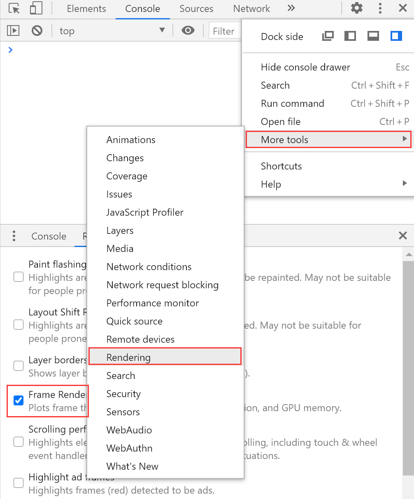

# 动画[B站教程](https://www.bilibili.com/video/BV1uJ411T7NN?p=2)

[toc]

## 对比过渡和动画

过渡`transition`是在两种状态间切换时的动画效果[MDN](https://developer.mozilla.org/zh-CN/docs/Web/CSS/transition)

动画`animation`通过`@keyframe`设定动画关键帧，可以同时设定多组动画[MDN](https://developer.mozilla.org/zh-CN/docs/Web/CSS/animation)

根据定义，`transition`可以看最作`animation`中，一组`@keyframe`包含`from（0%）`和`to（100%）`两个关键帧（状态）的特殊情况

区别如下：

`transition`

- 事件驱动：需要访客或JS使状态发生变化后触发
- 一次性：想要循环，需要反复修改状态
- 定义两个状态：开始状态和结束状态
- 可指定唯一过渡属性：`transition-property:all`默认两个状态间所有可过渡属性，都会有补间动画。可以通过`transition-property`指定可以唯一过渡属性

`animation`

- 自动执行或事件驱动
- 循环或指定执行次数
- 定义多个状态
- 不可指定唯一过渡属性
- 可控制：暂停，播放等

## 如何优化 CSS 动画的性能？

- 减少不必要动画
  - 设备：尽可能适应低配置设备
  - 耗电量：减少耗电量
  - 引发不适：避免闪烁、变化强烈、3D 眩晕动画
  - 用户原因（喜好、疾病、工作等）已配置减少动画

    综上，通过CSS媒体查询，在以下场景减少动画，始终避免引起不适的动画

    - 移动设备
    - refers-reduced-motion设置值为reduce
    - 主体内容不应该只有纯动画，适当的文字说明，利于读屏软件和SEO

- 提升动画体验
  - 减少不必要动画元素和属性，避免使用`transition:all`
  - 减少重排、重绘
  - 不同属性值引起改变，重新渲染有三种执行路径，尽量只使用合成属性
    |属性类型|执行路径|属性举例|
    |:---:|:---:|:---:|
    |重排属性|layout > paint > composite|盒模型:display padding margin width height min-height border-width;</hr>定位及浮动:position top bottom left right float clear;</hr>文字及溢出:font-family font-size font-weight line-height text-align vertical-align white-space overflow flow-y;|
    |重绘属性|paint > composite|color border-style border-radius visibility text-decoration background background-image background-position background-repeat background-size outline outline-color outline-style outline-width box-shadow|
    |合成属性|layout|transform opacity backface-visibility perspective perspective-origin|
  - 避免需要大量计算的属性`box-shadow:fliter`
  - 开启硬件加速`transform: translate3d(0, 0, 0)` `transform: translateZ(0)` `will-change:transform`可开启，内存占用可能增加
  - 创建层叠上下文，动画元素脱离文档流，独立图层，例如：
    - position为absolute或fixed
    - contain包含layout或paint
  


## 对比 CSS 动画和 JS 动画？

JS动画：

- IE5.5-IE9支持
- 报错时，影响其他脚本执行。定时器不准确
- 逻辑交互复杂
- JS在主线程的解析的环境中，阻塞或被阻塞其他操作。早期运行效率低。V8和现代架构浏览器已经改善

CSS动画：

- `transition` `animation`支持IE10+，早起是有属性多，不同环境效果策略不同
- 不支持的环境直接跳过
- 补间动画支持，设置关键帧刚容易。正在完善的事件和细颗粒度支持力度Animation()支持
- 可通过合成属性transform在compositor线程实现动画

JS动画依赖CSS样式：

- 通过CSS开启硬件加速
- 都应减少重排和重绘

CSS更细颗粒化控制

- 依赖JS

综上：

- 原来用JS的定时器，绘制每一帧，监听悬浮、获取焦点事件实现的动画和交互，都可以通过纯CSS动画配合伪类实现
- 未来JS更专注于复杂逻辑动画或对CSS的动画更细粒度的交互

## 纯 CSS 实现打字机效果

CSS 动画默认带过渡效果，浏览器会自动完成两个状态（关键帧）的补间动画，平滑过渡

step(num, start / end)属性，可以从两个状态的补间动画中，平均取num个帧（过渡状态），让动画在这些帧间直接跳转

step-start是setp(10, start)的简写，动画从开始状态起

step-end是step(10, end)的简写，动画从结束状态起

实现打字机效果，思路：

给一个DIV添加动画，宽width从0到文字总长度变化

有多少字，就从补间动画平均取多少个过渡状态，每状态对应显示一个字

光标闪烁，只有显示和隐藏两个状态，期间不需要过渡效果，并且无限循环

可见typing.html

## 纯 CSS 实现暗黑、夜间模式

- 匹配暗黑模式：`prefers-color-scheme:dark`表示当前系统的主题色为暗色
  - CSS媒体查询

    ```css
    @media(prefer-color-scheme:dark){
      /* 暗黑模式的CSS */
    }
    ```

- Link媒体查询

  ```html
  <link rel="stylesheet" href="dark.css" media="(prefers-color-scheme: dark)" />
  ```

- 实现暗黑模式
  - 变量：自己写具体样式

    ```css
    @media (prefers-color-scheme: dark) {
      :root {
      --color: white; /**为暗黑模式配置变量值**/
      }
    }
    html {
     color: var(--color);
    }
    ```

## 纯 CSS 实现骨架屏

骨架屏在数据加载前，优先展示页面的大体结构，通常用灰色的明暗变化的块，提高用户体验

纯CSS骨架屏适合Ajax和Fetch请求数据，填充模板引擎渲染的场景。如果请求的是页面本身，那么预渲染生成骨架屏是再好的方式

用子绝父相的定位方式，在需要显示骨架屏的元素内放置两个伪元素

- 一个盛满父元素，表示未填充数据前的元素
- 一个填充倾斜的渐变条纹，移动条纹位置，模拟进度条动画

参见Skeleton.html
