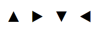

# 设计

[toc]

## 如何写小于10像素的字

Chrome浏览器在 chrome://settings/fonts 中允许用户设置最小字号

最小字号默认值为12px，font-size小于12px，会被强制设为最小字号

以下方法只对webkit生效(只有webkit对最小字体有限制)

```html
<style>
  selector {
    font-size : 10px;
    -webkit-transform : scale(0.8333);
  }
</style>
```

## 实现小于1像素的边

随时显示屏技术的发展，很多移动设备的分辨率媲美甚至超过大屏设备

在 CSS 中设置的像素宽度1px，在高分辨率的小屏设备上，可能会变粗

现代webkit内核浏览器提供私有属性`-webkit-min-device-pixel-ratio`或`-webkit-max-device-pixel-ratio`

用来当前设备的物理像素分辨率与CSS像素分辨率比值的最小值和最大值

- 通过媒体查询，将边框宽度设为`1px/devicePixelRatio`

  ```css
  .border { border: 1px solid }
  @media screen and (-webkit-min-device-pixel-ratio: 2) {
    .border { border: 0.5px solid }
  }
  @media screen and (-webkit-min-device-pixel-ratio: 3) {
    .border { border: 0.333333px solid }
  }
  ```

- 伪类+`resolution+transform`, 其中resolution是标准属性，可以实现与上面的有属性形同的设置，transform缩小伪类的高度是`1/devicePixelRatio`

  ```html
  <style>
  div::after {
    content: '';
    display: block;
    border-bottom: 1px solid;
  }
  @media only screen and (min-resolution: 2dppx) {
    div::after {
      -webkit-transform: scaleY(0.5);
      transform: scaleY(0.5);
    }
  }
  @media only screen and (min-resolution: 3dppx) {
    div::after {
      -webkit-transform: scaleY(0.33);
      transform: scaleY(0.33);
    }
  }
  </style>
  <div></div>
  ```

## 多方法实现图标

|实现方式|特殊符号|PNG/GIF|Sprites|Icon Front|SVG|
|:---:|:---:|:---:|:---:|:---:|:---:|
|大小|font-size|width height|background-size|font-size|width height|
|无锯齿|受font-family影响|放大可能有锯齿|放大可能有锯齿|windows字号较小时可能有影响|无锯齿|
|颜色|单色 使用color属性设置|图片本身颜色 可使用滤镜修改|图片本身颜色 可使用滤镜修改|单色 color属性修改|彩色 可修改|
|兼容性|不同浏览器可能效果不同|IE6不支持PNG透明|改大小IE9+
SVG Sprites IE9+|/|IE9+|
|响应式|-|√|√|-|√|
|透明|√|√|√|√|√|
|场景|简单图标+emoji|常用|HTTP1.1时合并请求|自定义字体|可定制图标|

## 多方法实现圆角边框

- 背景图片
- border:radius

  ```html
  <style>
  div {
    height: 250px;
    border: 10px solid;
    border-radius: 10px;
  }
  </style>
  <div></div>
  ```

- [clip:path](https://developer.mozilla.org/zh-CN/docs/Web/CSS/clip-path) 创建裁剪区域

  ```html
  <style>
  div {
    height: 250px;
    border: 10px solid;
    clip-path: inset(0 round 10px);
  }
  </style>
  <div></div>
  ```

## 多方法实现小三角



参见triangle.html

- 伪类+特殊符号
- 特殊符号+缩进+溢出+旋转
- 边框为零

## 多方法隐藏元素

|属性|不占位|读屏软件隐藏|用于隐藏主体内容SEO|
|:---:|:---:|:---:|:---:|
|display: none|√|√|不抓取|
|visibility: hidden|×|√|可能抓取|
|opacity: 0|×|×|疑似作弊|
|input type = hidden|√|√|不抓取|
|position:absolute/fixed|√|×|疑似作弊|
|aria-hidden = true|×|√|未知|
|text-indent < 0|√|×|常用于在 Logo 处标识网站名称|
|font-size: 0|√|×|疑似作弊|
|overflow: hidden|√(裁剪)||×|抓取|
|clip-path: polygon(0 0, 0 0, 0 0, 0 0)|√|×|未知|

## 实现文字描边

- [text-shadow](https://developer.mozilla.org/zh-CN/docs/Web/CSS/text-shadow)

  ```html
  <style>
  div {
    font-size: 100px;
    color: #fff;
    text-shadow: 0 0 3px black;
  }
  </style>
  <div>文字描边</div>
  ```

- -webkit-text-stroke

  ```html
  <style>
  div {
    font-size: 100px;
    color: #fff;
    -webkit-text-stroke: 3px black;
  }
  </style>
  <div>文字描边</div>
  ```

- `position: relative/position: absolute`子绝父相

  ```html
  <style>
    div {
      position: relative;
      font-size: 100px;
      color: #fff;
    }
    div p {
      position: absolute;
      margin: 0;
    }
    div p:first-child {
      font-weight: bolder;
      color: black;
    }
  </style>
  <div>
    <p>文字描边</p>
    <p>文字描边</p>
  </div>
  ```

## 实现渐变背景

- 背景图片，参见bgc.html
  - 一张1px高度沿渐变方向固定，重读铺满即可
- [linear-gradient](https://developer.mozilla.org/zh-CN/docs/Web/CSS/gradient/linear-gradient)
  
  ```html
  <style>
    div {
      height: 250px;
      background-image: linear-gradient(to bottom, pink, skyblue);
    }
  </style>
  <div></div>
  ```

- 对比常见的图片格式和base64图片

|拓展名|MIME|透明|动画|IE兼容性|特点|
|:---:|:---:|:---:|:---:|:---:|:---:|
|.ico|image/x-icon|√|×|IE|早期浏览器只支持 favicon.ico|
|.bmp|image/bmp|×|×|IE|windows 系统原生支持，图片信息丰富|
|.jpg|image/jpeg|×|×|IE|可控制品质，模糊到清晰或渐进加载，常见于照片|
|.png|image/png|√|×|IE6（不透明）|可控制品质、位数，常见于绘画|
|.gif|image/gif|√|√|IE|基于颜色透明，有毛边，256颜色上限，适合动画|
|.svg|image/svg+xml|√|×|IE9+|无损放大，可调色、修改，更常见于图标|
|.apng|image/apng|√|√|Edge|Mozilla主导，兼容PNG浏览器即可显示第一帧，压缩率较高，无毛边|
|.webp|image/webp|√|√|Edge|Coogle主导，压缩率更高，无毛边，常见于微信公众号|
|.avif|image/avif|√|√|×|Netflix主导，压缩率更高，无毛边，同压缩比效果有时超过 webp|

可以将图片转为 Base64 编码，直接将编码放入 CSS 中，即可引入图片

编码后的图片通常比原图大 30% 或更多，但可以与 CSS 一起被 gzip 或 br 压缩

适用小图片和没有权限上传图片的场景，来减少请求，但也应设置代码编辑器不换行或折叠图片编码区域，避免影响 CSS可读性

## 为什么要重制浏览器样式，对比Reset.css Normalize.css

- 什么是浏览器默认样式

  对于部分HTML标签，如段落、列表，部分表单元素，浏览器会提供默认样式，包含外观及交互，开发者只需引入标签，不需要重复定义这些样式，便于开发

- 为什么要重置浏览器默认样式
  - 不同浏览器，默认样式可能不同，特别是尺寸，位置的不同，让开发者无法统一用户体验，甚至有错位的风险
  - 只使用标签的语义，而不想引入样式
  - UI稿与浏览器默认样式不同
  
  基于以上，我们需要重置浏览器默认样式，以满足开发需求

- 对比两者
  - 共同点
    - 两者都能抹平浏览器间的默认样式差异
    - 都部分重置了浏览器默认样式，尤其是内外边距属性
  - 不同点
    - Reset.css让元素在不同浏览器样式完全一样
    - Normalize.css适当保留部分浏览器默认样式，只重置影响开发的样式，此外
      - Normalize.css修复了表单、SVG溢出等BUG
      - Normalize.css适当提高了可用性
      - Normalize.css避免大量使用群组选择器，通过注释提高调试体验
- 最佳实践
  - 对于绝大多数小型项目：
    - 只重置在页面中使用到的标签
    - 只重置有默认属性的属性名
    - 适当保留浏览器的默认样式，如表单的outline
