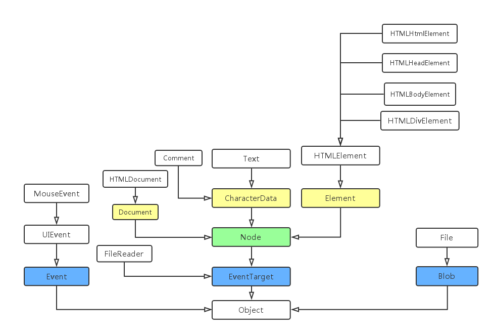
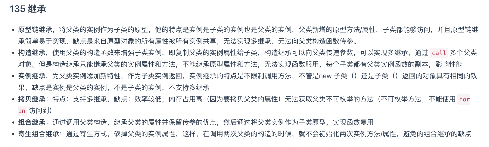

# 查漏补缺

[toc]

## [DOM中node和element区别](<https://www.programminghunter.com/article/3205745873/>)

## 常见的性能优化手段

- http
- css
- html
- js

## 继承

## 判断数组

- isArray
- instanceOf Array
- Object.prototype.toString().call(arr) = '[object Array]'
- arr.constructor.name === 'Array'

## 手写通用事件侦听函数
