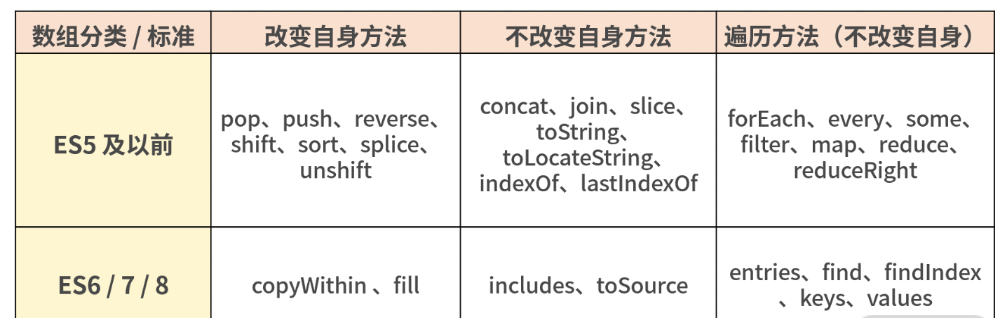
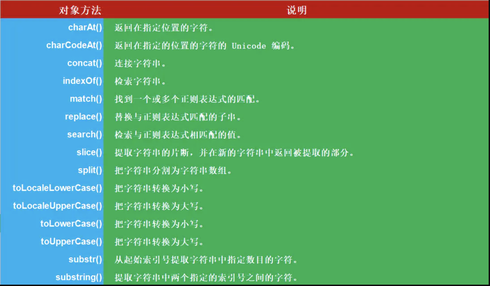
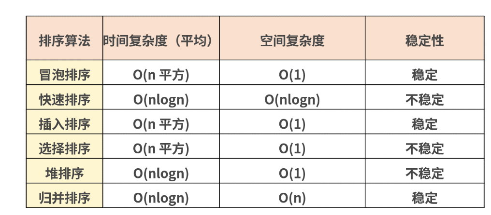
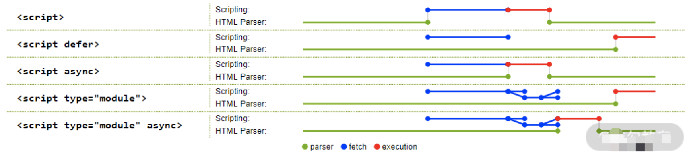
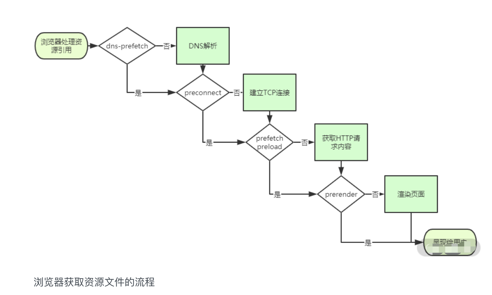

# 查漏补缺

[toc]

## [DOM中node和element区别](<https://www.programminghunter.com/article/3205745873/>)

## 常见的性能优化手段

- http
- css
- html
- js

## 继承

## 判断数组

- isArray
- instanceOf Array
- Object.prototype.toString().call(arr) = '[object Array]'
- arr.constructor.name === 'Array'

## 手写通用事件侦听函数

## 数组方法总结

## 排序

## defer-async

## 性能优化的一些HTML层面的方法

- `<script>` defer async type="module"
- `<link>` DNS预解析
  - preconnect。让浏览器在一个 HTTP 请求正式发给服务器前预先执行一些操作，这包括DNS 解析、TLS 协商、TCP 握手，通过消除往返延迟来为用户节省时间
  - prefetch/preload。两个值都是让浏览器预先下载并缓存某个资源，但不同的是，prefetch 可能会在浏览器忙时被忽略，而 preload 则是一定会被预先下载。
  - prerender。浏览器不仅会加载资源，还会解析执行页面，进行预渲染

   