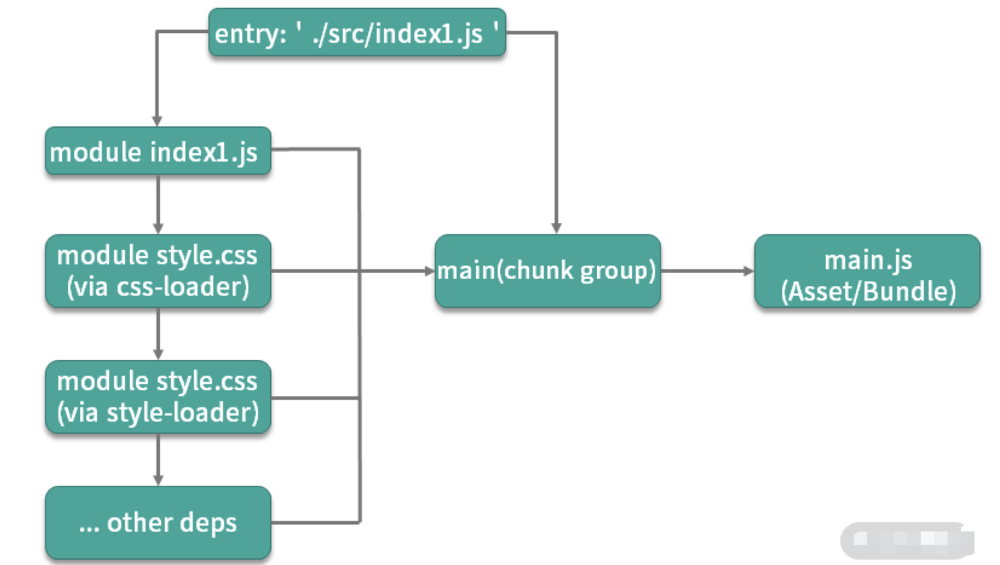

# webpack

[toc]

## 核心概念

- entry
- output
- loader: 模块转换器。本质就是一个函数，在该函数中对接收到的内容进行转换，返回转换后的结果。因为 Webpack 只认识 JavaScript，所以 Loader 就成了翻译官，对其他类型的资源进行转译的预处理工作。
- plugin: 扩展插件。基于事件流框架 `Tapable`，插件可以扩展 Webpack 的功能，在 Webpack 运行的生命周期中会广播出许多事件，Plugin 可以监听这些事件，在合适的时机通过 Webpack 提供的 API 改变输出结果。
- module

## 术语

- chunk: 指模块间按照引用关系组合成的代码块，一个 chunk 中可以包含多个 module
- chunk group: 指通过配置入口点（entry point）区分的块组，一个 chunk group 中可包含一到多个 chunk
- bundling
- asset/bundle

## 打包思想

1. 一切源代码文件均可通过各种 Loader 转换为 JS 模块 （module），模块之间可以互相引用。
2. webpack 通过入口点（entry point）递归处理各模块引用关系，最后输出为一个或多个产物包 js(bundle) 文件。
3. 每一个入口点都是一个块组（chunk group），在不考虑分包的情况下，一个 chunk group 中只有一个 chunk，该 chunk 包含递归分析后的所有模块。每一个 chunk 都有对应的一个打包后的输出文件（asset/bundle）

## 打包流程

- Webpack CLI 启动打包流程；
- 载入 Webpack 核心模块，创建 Compiler 对象；
- 使用 Compiler 对象开始编译整个项目；
- 从入口文件开始，解析模块依赖，形成依赖关系树；
- 递归依赖树，将每个模块交给对应的 Loader 处理；
- 合并 Loader 处理完的结果，将打包结果输出到 dist 目录。

## 核心

- Tapable：一个基于发布订阅的事件流工具类，Compiler 和 Compilation 对象都继承于 Tapable
- Compiler：compiler对象是一个全局单例，他负责把控整个webpack打包的构建流程。在编译初始化阶段被创建的全局单例，包含完整配置信息、loaders、plugins以及各种工具方法
- Compilation：代表一次 webpack 构建和生成编译资源的的过程，在watch模式下每一次文件变更触发的重新编译都会生成新的 Compilation 对象，包含了当前编译的模块 module, 编译生成的资源，变化的文件, 依赖的状态等
- 而每个模块间的依赖关系，则依赖于AST语法树。每个模块文件在通过Loader解析完成之后，会通过acorn库生成模块代码的AST语法树，通过语法树就可以分析这个模块是否还有依赖的模块，进而继续循环执行下一个模块的编译解析。

