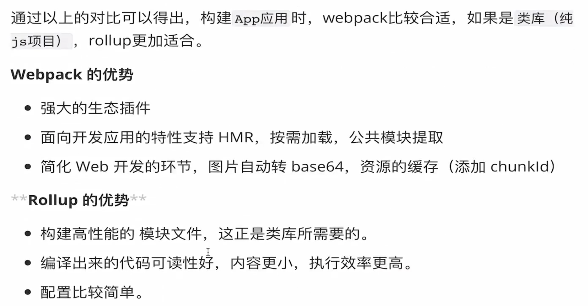

# 其他

[toc]

## proxy

接收客户端发送的请求后转发给其他服务器，目的是为了便于开发者在开发模式下解决跨域问题，webpack中提供的服务器为webpack-dev-server

```js
// ./webpack.config.js
const path = require('path')

module.exports = {
  // ...
  devServer: {
    contentBase: path.join(__dirname, 'dist'),
    compress: true,
    port: 9000,
    // 关于代理的配置
    proxy: {
      '/api': {
        target: 'https://api.github.com'
      }
    }
    // ...
  }
}
```

原理：

利用http-proxy-middleware这个http代理中间件，实现转发请求给其他服务器

在开发阶段，本地地址为`http://localhost:3000`，该浏览器发送一个前缀带有`/api`标识的请求到服务端获取数据，但响应这个请求的服务器只是将请求转发到另一台服务器中

跨域：

在开发阶段， webpack-dev-server 会启动一个本地开发服务器，所以我们的应用在开发阶段是独立运行在 localhost的一个端口上，而后端服务又是运行在另外一个地址上

所以在开发阶段中，由于浏览器同源策略的原因，当本地访问后端就会出现跨域请求的问题

通过设置webpack proxy实现代理请求后，相当于浏览器与服务端中添加一个代理者

当本地发送请求的时候，代理服务器响应该请求，并将请求转发到目标服务器，目标服务器响应数据后再将数据返回给代理服务器，最终再由代理服务器将数据响应给本地

在代理服务器传递数据给本地浏览器的过程中，两者同源，并不存在跨域行为，这时候浏览器就能正常接收数据；注意服务器之间不存在跨域问题

## babel

babel 的编译过程分为三个阶段：parsing、transforming、generating，以 ES6 编译为 ES5 作为例子：

- ES6 代码输入；
- babylon 进行解析得到 AST；
- plugin 用 babel-traverse 对 AST树进行遍历编译，得到新的 AST树；
- 用 babel-generator 通过 AST树生成 ES5 代码。

## rollup


