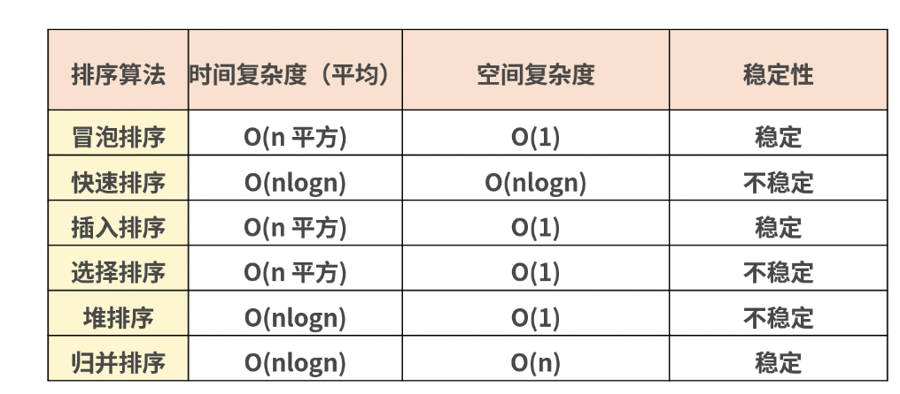

# 查漏补缺

[toc]

## [DOM中node和element区别](https://www.programminghunter.com/article/3205745873/)

## 判断数组

- `isArray`
- `instanceOf Array`
- `Object.prototype.toString.call(arr) === '[object Array]'`
- `arr.constructor.name === 'Array'` `arr.constructor === Array`

## 数组方法总结

- 改变自身的方法
  - `pop()` 删除并返回数组的最后一个元素
  - `push(element1, ..., elementN)` 向数组的末尾添加一个或者多个元素, 并返回新的长度
  - `reserve()` 用于颠倒数组中元素的顺序
  - `shift()` 用于把数组中第一个元素删除，并返回第一个元素的值
  - `sort([compareFunction])` 方法用于对数组的元素进行排序
  - `splice(start[, deleteCount[, item1[, item2[, ...]]]])` 用于插入、删除、替换数组中的元素
  - `unshift(element1, ..., elementN)` 将一个或多个元素添加到数组的头部，并返回该数组的新长度
  - `copyWithin(target[, start[, end]])` 方法浅复制数组的一部分到同一数组中的另一个位置，并返回它，不会改变原数组的长度。
    - `fill(value[, start[, end]])` 用一个固定值填充一个数组中从起始索引到终止索引内的全部元素。不包括终止索引

- 不改变自身的方法
  - `concat((value1[, value2[, ...[, valueN]]]))` 合并两个或多个数组。此方法不会更改现有数组，而是返回一个新数组。
  - `join([separator])` 将一个数组（或一个类数组对象）的所有元素连接成一个字符串并返回这个字符串。如果数组只有一个项目，那么将返回该项目而不使用分隔符。
  - `slice([begin[, end]])` 返回一个新的数组对象，这一对象是一个由 begin 和 end 决定的原数组的浅拷贝（包括 begin，不包括end）
  - `toString()` Array对象覆盖了Object的 toString 方法。对于数组对象，toString 方法连接数组并返回一个字符串，其中包含用逗号分隔的每个数组元素。
  - `toLocateString([locales[,options]])` 返回一个字符串表示数组中的元素。数组中的元素将使用各自的 toLocaleString 方法转成字符串，这些字符串将使用一个特定语言环境的字符串（例如一个逗号 ","）隔开
  - `indexOf(searchElement[, fromIndex])` 返回在数组中可以找到一个给定元素的第一个索引，如果不存在，则返回-1
  - `lastIndexOf(searchElement[, fromIndex])` 方法返回指定元素（也即有效的 JavaScript 值或变量）在数组中的最后一个的索引，如果不存在则返回 -1。从数组的后面向前查找，从 fromIndex 处开始。
  - `includes(valueToFind[, fromIndex])` 判断一个数组是否包含一个指定的值，根据情况，如果包含则返回 true，否则返回 false

- 数组的遍历方法
  - `forEach(callback(element[, index [, array]])[, thisArg])` 对数组的每个元素执行一次给定的函数
  - `every(callback(element[, index[, array]])[, thisArg])` 测试一个数组内的所有元素是否都能通过某个指定函数的测试。它返回一个布尔值
  - `some(callback(element[, index[, array]])[, thisArg])` 方法测试数组中是不是至少有 1 个元素通过了被提供的函数测试。它返回的是一个 Boolean 类型的值
  - `filter(callback(element[, index[, array]])[, thisArg])` 方法创建一个新数组，其包含通过所提供函数实现的测试的所有元素
  - `map(callback(element[, index[, array]])[, thisArg])` 创建一个新数组，这个新数组由原数组中的每个元素都调用一次提供的函数后的返回值组成
  - `reduce((previousValue, currentValue, currentIndex, array) => { /* ... */ }, initialValue)`(<https://developer.mozilla.org/zh-CN/docs/Web/JavaScript/Reference/Global_Objects/Array/Reduce>) 
  - `reduceRight()`
  - `entries()` 返回一个新的Array Iterator对象，该对象包含数组中每个索引的键/值对。
  - `find(callback(element[, index[, array]])[, thisArg])` 返回数组中满足提供的测试函数的第一个元素的值。否则返回 undefined
  - `findIndex(callback(element[, index[, array]])[, thisArg])` 返回数组中满足提供的测试函数的第一个元素的索引。若没有找到对应元素则返回 -1
  - `keys` 返回一个包含数组中每个索引键的Array Iterator对象
  - `values` 返回一个新的 Array Iterator 对象，该对象包含数组每个索引的值

## 字符串方法总结[MDN](https://developer.mozilla.org/zh-CN/docs/Web/JavaScript/Reference/Global_Objects/String/search)

- `charAt()` 从一个字符串中返回指定的字符
- `charCodeAt()` 回 0 到 65535 之间的整数，表示给定索引处的 UTF-16 代码单元
- `chartPointAt()` 返回 一个 Unicode 编码点值的非负整数
- `concat()` 将一个或多个字符串与原字符串连接合并，形成一个新的字符串并返回
- `endsWith()` 判断当前字符串是否是以另外一个给定的子字符串“结尾”的，根据判断结果返回 true 或 false
- 静态`String.fromCharCode()`方法返回由指定的 UTF-16 代码单元序列创建的字符串
- `String.fromCodePoint()` 静态方法返回使用指定的代码点序列创建的字符串
- `includes`
- `indexOf`
- `lastIndexOf`
- `localCompare`
- `match()` 检索返回一个字符串匹配正则表达式的结果
- `matchAll()` 返回一个包含所有匹配正则表达式的结果及分组捕获组的迭代器
- `normalize()` 方法会按照指定的一种 Unicode 正规形式将当前字符串正规化
- `paddingStart`
- `paddingEnd`
- `repeat`
- `replace`
- `replaceAll`
- `search`
- `slice`
- `splite`
- `startsWith`
- ...

## 排序

## defer-async

## 性能优化的一些HTML层面的方法

- `<script>` defer async type="module"
- `<link>` DNS预解析
  - preconnect。让浏览器在一个 HTTP 请求正式发给服务器前预先执行一些操作，这包括DNS 解析、TLS 协商、TCP 握手，通过消除往返延迟来为用户节省时间
  - prefetch/preload。两个值都是让浏览器预先下载并缓存某个资源，但不同的是，prefetch 可能会在浏览器忙时被忽略，而 preload 则是一定会被预先下载。
  - prerender。浏览器不仅会加载资源，还会解析执行页面，进行预渲染

   

## 渲染机制

