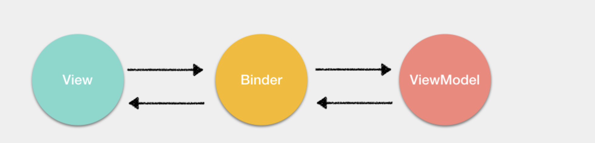

# MVVM_VDOM_前端路由

[toc]

## 什么是MVVM，与MVC区别？

首先，view就是用户看到的视图，model就是本地数据和数据库中的数据

传统的MVC架构通常是使用控制器更新模型，视图从模型中获取数据去渲染。当用户有输入时，会通过控制器去更新模型，并且通知视图进行更新。

缺点是controller承担的责任较大，代码臃肿，不利于维护

在 MVVM 架构中，引入了 ViewModel 的概念。ViewModel 只关心数据和业务的处理，不关心 View 如何处理数据，在这种情况下，View和 Model 都可以独立出来，任何一方改变了也不一定需要改变另一方，并且可以将一些可复用的逻辑放在一个 ViewModel 中，让多个 View 复用这个 ViewModel。

以Vue框架为例，ViewModel就是组件的实例，View就是模板，Model就是vuex。

除了以上三个部分，其实在 MVVM 中还引入了一个隐式的 Binder 层，实现了 View 和 ViewModel 的绑定

同样以 Vue 框架来举例，这个隐式的 Binder 层就是 Vue 通过解析模板中的插值和指令从而实现 View 与 ViewModel 的绑定。

对于 MVVM来说，其实最重要的并不是通过双向绑定或者其他的方式将 View 与 ViewModel 绑定起来，而是通过 ViewModel 将视图中的状态和用户的行为分离出一个抽象，这才是 MVVM 的精髓

## Virtual DOM

### 什么是VDOM

JS模拟DOM

DOM 是一个多叉树的结构，如果需要完整的对比两颗树的差异，那么需要的时间复杂度会是 `O(n^3)`

### VDOM的优点

- 跨平台
- 实现组建的高度抽象化
- 性能未必是最好的

## 前端路由原理

- hash模式

  通过hashchange的改变监听url的改变，从而跳转页面

  相对简单，兼容性好

- history模式

  通过history.pushState()和history.replaceState()改变url

- 对比
  - Hash模式只可以更改 # 后面的内容，History 模式可以通过 API 设置任意的同源 URL
  - History 模式可以通过 API 添加任意类型的数据到历史记录中，Hash 模式只能更改哈希值，也就是字符串
  - Hash 模式无需后端配置，并且兼容性好。**History 模式在用户手动输入地址或者刷新页面的时候会发起 URL 请求，后端需要配置 index.html 页面用于匹配不到静态资源的时候**
