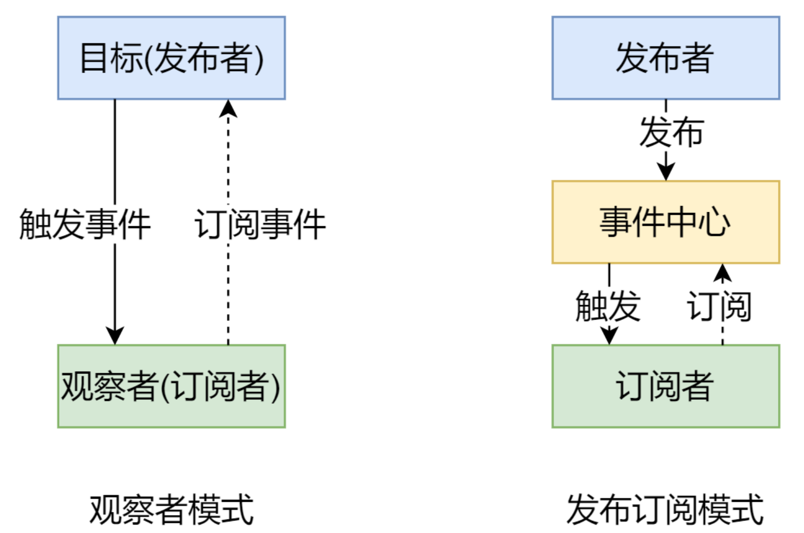

# vue

[toc]

## 响应式原理

- Vue
  - 记录传入的选项，设置 \$data/\$el
  - 把 data 的成员注入到 Vue 实例
  - 负责调用 Observer 实现数据响应式处理(数据劫持)
  - 负责调用 Compiler 编译指令/插值表达式等
- Observer
  - 数据劫持
  - 负责把 data 中的成员转换成 getter/setter
  - 负责把多层属性转换成 getter/setter
  - 如果给属性赋值为新对象，把新对象的成员设置为 getter/setter
  - 添加 Dep 和 Watcher 的依赖关系
  - 数据变化发送通知
- Compiler
  - 负责编译模板，解析指令/插值表达式
  - 负责页面的首次渲染过程
  - 当数据变化后重新渲染
- Dep
  - 收集依赖，添加订阅者(watcher)
  - 通知所有订阅者
- Watcher
  - 自身实例化的时候往dep对象中添加自己
  - 当数据变化dep通知所有的 Watcher 实例 更新视图

### Vue2.x

Objecj.defineProperty()

### Vue3.x

newProxy()

## 发布订阅模式和观察者模式

- 观察者模式是由具体目标调度，比如当事件触发，Dep 就会去调用观察者的方法，所以观察者模式的订阅者与发布者之间是存在依赖的
- 发布/订阅模式由统一调度中心调用，因此发布者和订阅者不需要知道对方的存在

### 发布订阅模式

我们假定有一个信号中心，某个任务执行完成，就像信号中心publish一个信号，其他任务可以向信号中心订阅subscribe这个信号，从而知道什么自己可以开始执行，这就叫做发布订阅模式

- 自定义事件
- 兄弟组件之间的通信
  
### 观察者模式

代码

- 观察者(订阅者) -- Watcher
  - update():当事件发生时，具体要做的事情
- 目标(发布者) -- Dep
  - subs 数组:存储所有的观察者
  - addSub():添加观察者
  - notify():当事件发生，调用所有观察者的 update() 方法
- 没有事件中心

## VDOM

### 为什么使用VDOM

手动操作DOM比较麻烦 => 为简化操作，出现了MVVM框架(解决了视图和状态同步的问题) => 简化视图操作就出现了模板引擎，但是模板引擎没有解决跟踪状态变化的问题，于是出现了VDOM => VDOM的好处是状态发生变化时不需要立即更新DOM，之需要创建一个虚拟树出来，虚拟树内部进行diff更新DOM => 虚拟树还可以跟踪状态变化

作用

- 维护试图和状态的关系
- 复杂试图情况下提升渲染性能
- 除了渲染DOM外，还能实现SSR、原生应用、小程序等跨平台
  
### 三个part

- 虚拟节点类：将DOM节点用js对象的形式展示，并提供render方法，将虚拟节点渲染成为真是DOM
- 节点diff比较：对虚拟节点进行js层面的比较，并将不同的操作都记录到patch对象
- re-render：解析patch对象，进行render

### VDOM的必要性

- 创建真实DOM的代价更低
- 减少浏览器的重绘及回流

### 为什么Vue要采用VDOM

- 性能仅仅是一方面的考量：性能未必优异
- 解耦HTML依赖
  - 不依赖HTML解释器进行模板解析
  - 实现多平台

## nextTick

让我们在下次DOM更新循环之后执行延迟回调，用于获取更新后的DOM

主要使用了宏任务和微任务。根据执行环境分别采用

- Promise
- MutationObserve
- setImmediate
- 以上都不行采用setTimeOut

## 生命周期

|项目|Vue2|Vue3|
|:---:|:---:|:---:|
|组件生命周期|`beforeCreate` `created` `beforeMount` `mounted` `beforeUpdate` `updated` `beforeDestory` `destoryed` `actived` `deactived` `errorCaptured`|`onMounted()` `onUpdated()` `onUnmounted()` `onBeforeMount()` `onBeforeUpdate()` `onBeforeUnmount()` `onErrorCaptured()` `onRenderTracked()` `onRenderTriggered()` `onActivated()` `onDeactivated()` `onServerPrefetch()`|

Vue2生命周期

- `initLifecycle/Event`: 往vm上挂载各种属性
- `beforeCreated`: 实例刚创建
`initInjection/initStat`e: 初始化注入和 data 响应性
- `created`: 创建完成，属性已经绑定， 但还未生成真实dom`
- 进行元素的挂载： `$el / vm.$mount()`
  - 是否有template: 解析成 render function
  - *.vue文件: vue-loader会将 `<template>` 编译成render function
- `beforeMount`: 模板编译/挂载之前
- 执行`render function`，生成真实的dom，并替换到dom tree中
`mounted`: 组件已挂载
- 执行diff算法，比对改变是否需要触发UI更新
- `flushScheduleQueue`
- watcher.before: 触发`beforeUpdate`钩子 - watcher.run(): 执行watcher中的 notify，通知所有依赖项更新UI
- 触发`updated`钩子: 组件已更新
- `actived / deactivated(keep-alive)`: 不销毁，缓存，组件激活与失活
- `destroy`
- `beforeDestroy`: 销毁开始
- 销毁自身且递归销毁子组件以及事件监听
  - `remove()`: 删除节点
  - `watcher.teardown()`: 清空依赖
  - `vm.$off()`: 解绑监听
- `destroyed`: 完成后触发钩子

Vue3生命周期

## Vue-router

模式

- hash
- history

跳转

- `<router-link to="path">`
- `router.push(path)`

站位：`<router-view>`

源码实现
