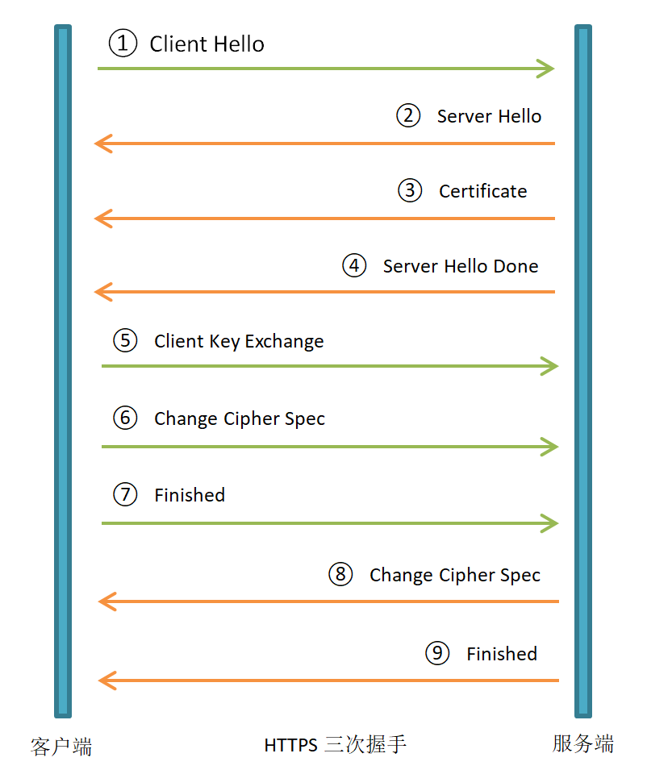

# 计算机网络

[toc]

## 对比持续通信的方法？

- 轮询
  - 通过setTimeout或者setInterval定时获取并刷新页面上的数据
  - 定时查询，不一定有新数据
  - 并发较多时，增加服务器负担
- 长连接
  - 页面其纳入iframe，将src设为长连接
  - 减少无用请求
  - 并发较多时增加服务器负担
- 长轮询
  - 服务端收到请求后，hold住链接，直到有新消息返回时才相应
  - 减少无用请求
  - 返回数据顺序无保证
- Flash Socket
  - 客户端通过嵌入Socket类Flash与服务器端的Socket接口通信
  - 真正的即时通信
  - 非HTTP协议，无法自动穿越防火墙
- WebSocket
  - 在客户端和服务器端打开交互式通信会话
  - 兼容HTTP协议。与HTTP同属应用层。默认端口是80和443
  - 建立在TCP协议的基础上，与HTTP协议同属于应用层
  - 数据格式轻量，性能开销小，通信高效
  - 可以发送文本，也可以发送二进制数据
  - **没有同源限制**
  - 协议表示符ws 加密wss
  
    socket.io
  
    - 跨平台的Websocket库，API前后端一致，可以触发和相应自定义事件

      ```js
      // 服务端
      const io = require("socket.io")(3000)
      io.on('connection', socket => {
        socket.on('update item', (arg1, arg2, callback) => {
          console.log(arg1, arg2)
          callback({ status: 'fulfilled' })
        })
      })
      // 客户端
      const socket = io()
      socket.emit('update item', "1", { name: 'updated' }, res => {
        console.log(res.status) // ok
      })
      ```

## 网络结构按五层和七层分别是？

TCP / IP 体系结构

- 网络接口层
- 网际层 IP
- 运输层 TCP 或 UDP
- 应用层（TELNET FTP SMTP等）

五层

- 物理层
- 数据链路层
- 网络层
- 运输层
- 应用层

七层：Open System Inerconnect Reference Model 开放式系统互联通信参考模型

- 物理层
- 数据链路层
- 网络层
- 传输层
- 会话层
- 表达层
- 应用层

## 什么是 TCP 三次握手，为什么要三次握手？

### 什么是 TCP 三次握手？

- 起初
  - 客户端 CLOSED
  - 服务端 CLOSED
- 第一次握手
  - 客户端发送请求报文
    - 传输自身通讯初始序号
    - 客户端 SYN-SENT
- 第二次握手
  - 服务器接收请求报文
    - 同意连接
      - 传输自身通讯初始序号
      - 服务端 SYN-RECEIVED
    - 拒绝连接
      - 服务端 REFUSED
- 第三次握手
  - 客户端接收应答报文
    - 客户端发送确认报文
    - 客户端 ESTABLISHED
  - 服务端接收确认报文
    - 服务端 ESTABLISHED

### 为什么要三次握手？

- 客户端首次发送请求无应答，TCP 启动超时重传
- 服务器收到重传的请求，建立连接，接收数据，关闭连接
- 服务器收到客户端首次发送请求，再次建立连接，但客户端已经关闭连接

需要三次握手，客户端发送确认报文后再建立连接，避免重复建立连接

## 浏览器有哪些请求方法？

安全：请求会倾向服务器资源

幂等：多次执行重复操作，结果相同

|方法|描述|请求体|响应体|支持表单|安全|幂等|可缓存|
|:---:|:---:|:---:|:---:|:---:|:---:|:---:|:---:|
|GET|请求资源|无|有|是|是|是|是|
|HEAD|请求资源头部|无|无|否|是|是|是|
|POST|发送数据 数据类型由Content-type指定|有|有|是|否|否|响应头包含expires和max-age|
|PUT|发送负载创建或者替换目标资源|有|无|否|否|是|否|
|DELETE|删除资源|不限|不限|否|否|是|否|
|CONNECT|创建点到点沟通隧道|无|有|否|否|否|否|
|OPTIONS|检测服务器支持方法|无|有|否|是|是|否|
|TRACE|消息环路测试 多用于路由检测|无|无|否|是|是|否|
|PATCH|部分修改资源|有|有|否|否|否|否|

## 提交表单的内容类型有哪些？

- application/x-www-form-urlencoded：初始的默认值

  ```http
  Content-Type：application/x-www-form-urlencoded
  ...
  key1=value1&key2=value2
  ```

- multipart/form-data：适用于使用`<input>`标签上传的文件

  ```http
  Content-Type：multipart/form-data; boundary=------数据边界值
  ...
  ------数据边界值
  Content-Disposition: form-data; name="key1"
  value1
  ------数据边界值
  Content-Disposition: form-data; name="key2"
  value2
  ```

- text/plain：HTML5 引入类型

  ```http
  Content-Type：text/plain
  ...
  key1=value1
  key2=value2
  ```

## docker 与虚拟机区别

- 启动速度
  - Docker：秒级启动
  - 虚拟机：几分钟启动
- 需要资源
  - Docker：操作系统级别虚拟化，与内核直接交互，几乎没有性能损失
  - 虚拟机：
    - 通过虚拟机监视器（通过虚拟机监视器（Virtual machine monitor，VMM，Hypervisor）
    - 厂商：Citrix XenServer，Hyper-V，开源 KVM 、Xen、VirtualBSD
- 轻量
  - Docker：内核与应用程序可共享，占用内存极小，资源利用率高
  - 虚拟机：同样硬件环境，Docker运行的镜像数量远多于虚拟机数量
- 安全性
  - Docker：安全性更弱。租户root与宿主机root等同，有提权安全风险
  - 虚拟机：
    - 租户root权限与宿主机root虚拟机权限分离
    - 用如 Intel 的 VT-d 和 VT-x 的 ring-1 硬件隔离技术，虚拟机难以突破 VMM 直接与宿主或彼此交互
- 可管理型
  - Docker：集中化管理工具还不算成熟
  - 虚拟机：拥有相对完备的集中化管理工具
- 高可用和可恢复性
  - Docker：依靠 快速重新部署 实现
  - 虚拟机：负载均衡、高可用、容错、迁移、数据保护，VMware可承诺 SLA（服务级别协议）99.999% 高可用
- 快速创建、删除
  - Docker：秒级别，开发、测试、部署更快
  - 虚拟机：分钟级别
- 交付、部署
  - Docker：在 Dockerfile 中记录了容器构建过程，可在集群中实现快速分发和快速部署
  - 虚拟机：支持镜像

## 对比 Intel 的 VT-x，VT-d，VT-c

- VT-x
  - 运行 ESXI 上的 64位 Guest OS 基本指令
  - Intel 运用Virtualization 虚拟化技术中的指令集
  - 减少 VMM 干预，硬件支持 VMM 与 Guest OS
  - 需要 VMM 干预，更快速、可靠、安全切换
  - 更灵活、更稳定
- VT-d
  - 使一个 Guest OS 独占并直接存取硬件设备，加快读写速度
  - 开启条件：北桥芯片支持，BIOS 开启
- VT-c
  - Virtual Machine Direct Connect
    - 虚拟机的虚拟网络卡传送透过 VMM 来进行传输
    - Guest OS 可以直接对 实体网络 I/O 进行存取
    - 加强 VT-d，让多个虚拟机与实体 I/O 装置同时建立通道
  - Virtual Machine Direct Queues
    - 由 VMM 管理的虚拟化 Switch 转送封包给虚拟机
      - 封包流向哪个虚拟机，需要额外 CPU 资源
    - 透过网卡内建 Layer2 classifier / sorter 加速网络资料传送
      - 在芯片里安排并通过队列排序好封包给虚拟机，不需要 VMM 支持
        - 大大降低网络负载和 CPU 使用率

## 什么是 URL ？[mdn参考](https://developer.mozilla.org/zh-CN/docs/Learn/Common_questions/What_is_a_URL)

- URL（Uniform Resource Locator）（统一资源定位器）是指定在 Internet 上可以找到资源的位置的文本字符串
  - 在 HTTP 的上下文中，URL 被叫做“网络地址”或“链接”
  - 浏览器在其地址栏显示 URL，例如 <https://leetcode-cn.com>
  - URL 也可用于文件传输（FTP），电子及邮件（SMTP）和其他应用
- URL 接口用于解析、构造、规范化和编码 URLs
  - 通过调用 URL 构造函数 new URL(url, [, base]) 创建并返回一个 URL 对象
    - 该 URL 对象引用使用绝对 URL 字符串
    - 或相对 URL 字符串和基本 URL 字符串指定的 URL
  - 通过 URL 对象读取已解析的组成部分或对 URL 进行更改
- `<url>`是 CSS 中的一种数据类型
  - `<url>`没有独有的表达形式，只能通过 url() 函数定义
  - url() 函数中的 URL 可以使用单引号或双引号包含，也可以直接书写
    - 使用相对地址时，相对地址相对于 CSS 样式表的 URL （而不是网页的 URL）

## 什么是 HTTP 报文？

### 定义

HTTP 全称 Hypertext Transfer Protocol，超文本传输协议，是应用层协议

HTTP 报文由从客户端到服务器的请求和从服务器到客户端的响应构成

### 组成

- 起始行：报文描述
- 头部：报文属性
- 主体：报文数据

### 分类

- 请求报文：客户端到服务端发送请求
  - 请求行：方法 + URL + HTTP协议版本
  - 通用信息头：Connection 等
  - 请求头
  - 实体头：POST / PUT / PATCH 的 Content-Type Content-Length 等
  - 报文主体
- 响应报文：服务端到客户端返回数据
  - 状态行：状态码 + 原因
  - 通用信息头：Connection等
  - 响应头
  - 实体头：Content-Type Content-Length 等
  - 报文主体

## 常见的 HTTP 状态码有哪些？

|状态码|原因|说明|
|:--:|:---:|:---:|
|100-199|信息响应|
|100|Continue|已收到请求，客户端应继续
|101|Switching Protocol|响应客户端Upgrade列出协议，服务端正在切换协议|
|102|Processing|服务端正在处理请求，无响应可用|
|103|Early Hints|与Link一起使用，客户端应在服务端继续响应前开始预加载资源|
|200-299|成功响应|
|200|OK|请求成功，常见于GET HEAD POST TRACE|
|201|Created|请求成功，新资源已创建，常见于POST PUT|
|202|Accepted|请求已收到，但未响应|
|203|Non-Authoritative Information|响应经过了代理服务器修改|
|204|No Content|请求已处理，无返回，客户端不更新视图|
|205|Reset Content|请求已处理，无返回，客户端应更新视图|
|206|Partial Content|请求已处理，返回部分内容，常见于视频点播、分段下载、断点续传|
|300-399|重定向|
|300|Multiple Choice|提供一系列地址供客户端选择重定向|
|301|Moved Permanently|永久重定向，默认可缓存，搜索引擎应更新链接|
|302|Found|临时重定向，默认不缓存，除非显示指定|
|303|See Other|临时重定向，必须GET请求|
|304|Not Modified|未修改，不含响应体|
|307|Temporary Redirect|临时重定向，默认不缓存，除非显示指定，不改变请求方法和请求体|
|308|Permanent Redirect|永久重定向，默认可缓存，搜索引擎应更新链接，不改变请求方法和请求体|
|400-499|客户端错误|
|400|Bad Request|请求语义或参数有误，不应重复请求|
|401|Unauthorized|请求需身份验证或验证失败|
|403|Forbidden|拒绝，不应重复请求|
|404|Not Found|未找到，无原因|
|405|Method Not Allowed|不允许的请求方法，并返回 Allow 允许的请求方法列表|
|406|Not Acceptable|无法根据请求条件，返回响应体|
|407|Proxy Authentication Required|请求需在代理服务器上身份验证|
|408|Request Timeout|请求超时|
|409|Conflict|请求冲突，响应应包含冲突原因|
|410|Gone|资源已被永久移除|
|411|Length Required|请求头需添加 Content-Length|
|412|Precondition Failed|非 GET POST 请求外，If-Unmodified-Since 或 If-None-Match 规定先决条件无法满足|
|413|Payload Too Large|请求体数据大小超过服务器处理范围|
|414|URI Too Long|URL过长，查询字符串过长时，应使用 POST 请求|
|415|Unsupported Media Type|请求文件类型服务端不支持|
|416|Range Not Satisfiable|请求头 Range 与资源可用范围不重合|
|417|Expectation Failed|服务端无法满足客户端通过 Expect 设置的期望响应|
|421|Misdirected Request|HTTP2 下链接无法复用时返回|
|425|Too Early|请求有重放攻击风险|
|426|Upgrade Required|客端应按响应头Upgrade的协议列表中的协议重新请求|
|428|Precondition Required|没有符合 If-Match 的资源|
|429|Too Many Requests|请求频次超过服务端限制|
|431|Request Header Fields Too Large|请求头字段过大|
|451|Unavailable For Legal Reasons|因法律原因该资源不可用|
|500-511|服务端响应|
|500|Internal Server Error|服务端报错，通常是脚本错误|
|501|Not Implemented|请求方法不被服务器支持|
|502|Bad Gateway|网关无响应，通常是服务端环境配置错误|
|503|Service Unavailable|服务端临时不可用，建议返回 Retry-After，搜索引擎爬虫应一段时间再次访问这个URL|
|504|Gateway Timeout|网关超时，通常是服务端过载|
|505|HTTP Version Not Supported|请求的 HTTP 协议版本不被支持|
|506|Variant Also Negotiates|内部服务器配置错误|
|510|Not Extended|不支持 HTTP 扩展|
|511|Network Authentication Required|需要身份验证，常见于公用 WIFI|

## 常用的 HTTP 方法有哪些，GET 和 POST 的区别是什么？

### 常见方法见上文

### 区别

从w3schools得到的标准答案的区别如下：

- GET在浏览器回退时是无害的，而POST会再次提交请求。
- GET产生的URL地址可以被Bookmark，而POST不可以。
- GET请求会被浏览器主动cache，而POST不会，除非手动设置。
- GET请求只能进行url编码，而POST支持多种编码方式。
- GET请求参数会被完整保留在浏览器历史记录里，而POST中的参数不会被保留。
- GET请求在URL中传送的参数是有长度限制的，而POST没有。
- 对参数的数据类型，GET只接受ASCII字符，而POST没有限制。
- GET比POST更不安全，因为参数直接暴露在URL上，所以不能用来传递敏感信息。
- GET参数通过URL传递，POST放在Request body中

#### 参数位置

貌似从上面看到GET与POST请求区别非常大，但两者实质并没有区别

无论 GET 还是 POST，用的都是同一个传输层协议，所以在传输上没有区别

当不携带参数的时候，两者最大的区别为第一行方法名不同

```http
POST /uri HTTP/1.1 \r\n
GET /uri HTTP/1.1 \r\n
```

当携带参数的时候，我们都知道GET请求是放在url中，POST则放在body中

GET 方法简约版报文是这样的

```http
GET /index.html?name=qiming.c&age=22 HTTP/1.1
Host: localhost
```

POST 方法简约版报文是这样的

```http
POST /index.html HTTP/1.1
Host: localhost
Content-Type: application/x-www-form-urlencoded

name=qiming.c&age=22
```

注意：这里只是约定，并不属于HTTP规范，相反的，我们可以在POST请求中url中写入参数，或者GET请求中的body携带参数

#### 参数长度

HTTP 协议没有Body和 URL 的长度限制，对 URL 限制的大多是浏览器和服务器的原因

IE对URL长度的限制是2083字节(2K+35)。对于其他浏览器，如Netscape、FireFox等，理论上没有长度限制，其限制取决于操作系统的支持

这里限制的是整个URL长度，而不仅仅是参数值的长度

服务器处理长 URL 要消耗比较多的资源，为了性能和安全考虑，会给 URL 长度加限制

#### 安全

POST 比 GET 安全，因为数据在地址栏上不可见

然而，从传输的角度来说，他们都是不安全的，因为 HTTP 在网络上是明文传输的，只要在网络节点上捉包，就能完整地获取数据报文

只有使用HTTPS才能加密安全

#### 数据包

对于GET方式的请求，浏览器会把http header和data一并发送出去，服务器响应200（返回数据）

对于POST，浏览器先发送header，服务器响应100 continue，浏览器再发送data，服务器响应200 ok

并不是所有浏览器都会在POST中发送两次包，Firefox就只发送一次

## 常见的 HTTP 请求头和响应头有哪些？

|请求头|描述|示例|
|:---:|:---:|:---:|
|Accept|用户代理支持的MIME类型列表|Accept: text/html,application/xhtml+xml,application/xml;q=0.9,image/avif,image/webp,image/apng,/;q=0.8,application/signed-exchange;v=b3;q=0.9|
|Accept-Encoding|用户代理支持的压缩方法（优先级）|Accept-Encoding: br, gzip, deflate|
|Accept-Language|用户代理期望的语言（优先级）| Accept-Language: zh-CN,zh;q=0.9|
|Cache-Control|缓存机制|Cache-Control: max-age=0|
|Connection|是否持久连接|Connection: keep-alive|
|Cookie|HTTP cookies|服务器通过 Set-Cookie 存储到客户端的 Cookie|
|Host|主机名 + 端口号|Host: 127.0.0.1:8080|
|If-Match|请求指定标识符资源|If-Match: "56a88df57772gt555gr5469a32ee75d65dcwq989"|
|If-Modified-Since|请求指定时间修改过的资源|If-Modified-Since: Wed, 19 Oct 2020 17:32:00 GMT|
|If-None-Match|请求非指定标识符资源|If-None-Match: "56a88df57772gt555gr5469a32ee75d65dcwq989"|
|Upgrade-Insecure-Requests|客户端优先接受加密和有身份验证的响应，支持CSP Upgrade-Insecure-Requests: 1|
|User-Agent|用户代理|User-Agent: Mozilla/5.0 (Windows NT 10.0; Win64; x64) AppleWebKit/537.36 (KHTML, like Gecko) Chrome/88.0.4324.150 Safari/537.36|
|Vary|缓存策略|Vary: User-Agent 常用于自适应缓存配置和 SEO|

|响应头|描述|示例|
|:---:|:---:|:---:|
|Cache-Control|缓存机制|Cache-Control: public, max-age=3600|
|Connection|是否持久连接|Connection: keep-alive|
|Content-Encoding|内容编码方式|Content-Encoding: br|
|Content-Type|内容的MIME类型|Content-Type: text/html; charset=UTF-8|
|Date|报文创建时间|Date: Sun, 28 Feb 2021 11:52:51 GMT|
|Expires|资源过期时间|Expires: Sun, 28 Feb 2021 12:52:51 GMT|
|ETag|资源标识符|ETag: "56a88df57772gt555gr5469a32ee75d65dcwq989"|
|Set-Cookie|服务端向客户端发送Cookie|Set-Cookie: __yjs_duid=1_7a24a73cae0e4926e7604ec1fd9277eb1614513171854; expires=Tue, 30-Mar-21 11:52:51 GMT; Path=/; Domain=baidu.com; HttpOnly|

## 什么是 HTTPS，与 HTTP 的区别？

### 什么是 HTTPS？

HTTPS 的全称是 Hyper Text Transfer Protocol over SecureSocket Layer，基于安全套接字协议 SSL，提供传输加密和身份认证保证传输的安全性，通过证书确认网站的真实性

HTTP2.0 和 HTTP3.0 都只用于 https:// 网址

### HTTPS 三次握手



① Client Hello：客户端将支持 SSL 版本、加密算法、密钥交换算法等发送服务端

② Server Hello：服务端确定 SSL 版本、算法、会话 ID 发给客户端

③ Certificate：服务端将携带公钥的数字证书发给客户端

④ Server Hello Done：通知客户端版本和加密套件发完，准备交换密钥

⑤ Client Key Exchange：客户端验证证书合法性，随机生成 premaster secret（预主密钥） 用公钥加密发给服务端

⑥ Change Cipher Spec：通知服务端后续报文采用协商好的密钥和加密套件

⑦ Finished：客户端用密钥和加密套件计算已交互消息的 Hash 值发给服务端。服务端进行同样计算，与收到的客户端消息解密比较，相同则协商成功

⑧ Change Cipher Spec：通知客户端后续报文采用协商好的密钥和加密套件

⑨ Finished：服务端用密钥和加密套件计算已交互消息的 Hash 值发给服务端。客户端进行同样计算，与收到的服务端消息解密比较，相同则协商成功

### HTTPS与HTTP对比

|项目|HTTP|HTTPS|
|:---:|:---:|:---:|
|默认端口|80|443|
|HTTP版本|1.0 - 1.1|2 - 3|
|传输|明文，易被劫持|加密，不易劫持|
|浏览器标识|不安全|安全|
|CA|认证|不支持 支持|
|SEO|无优待|优先|

## 对比 HTTP1.0 / HTTP1.1 / HTTP2.0 / HTTP3.0？

### HTTP1.0

无状态，无连接的应用层协议

- 无法复用连接，每次发送请求，都要新建连接
- 队头阻塞，下个请求必须在上个请求响应到达后发送。如果上个请求响应丢失，则后面请求被阻塞

### HTTP1.1

HTTP1.1 继承了 HTTP1.0 简单，克服了 HTTP1.0 性能上的问题

- 长连接，新增 Connection: keep-alive 保持永久连接
- 管道化，支持管道化请求，请求可以并行传输，但响应顺序应与请求顺序相同。实际场景中，浏览器采用建立多个TCP会话的方式，实现真正的并行，通过域名限制最大会话数量
- 缓存处理，新增 Cache-control，支持强缓存和协商缓存
- 断点续传
- 主机头，新增 Host 字段，使得一个服务器创建多个站点

### HTTP2.0

HTTP2.0进一步改善了传输性能

- 二进制分帧，在应用层和传输层间增加二进制分帧层
- 多路复用，建立双向字节流，帧头部包含所属流 ID，帧可以乱序发送，数据流可设优先级和依赖。从而实现一个 TCP 会话上进行任意数量的HTTP请求，真正的并行传输
- 头部压缩，压缩算法编码原来纯文本发送的请求头，通讯双方各自缓存一份头部元数据表，避免传输重复头
- 服务器推送,服务端可主动向客户端推送资源，无需客户端请求

### HTTP3.0

当一个 TCP 会丢包时，整个会话都要等待重传，后面数据都被阻塞。这是由于 TCP 本身的局限性导致的。HTTP3.0 基于 UDP 协议，解决 TCP 的局限性

- 0-RTT，缓存当前会话上下文，下次恢复会话时，只需要将之前缓存传递给服务器，验证通过，即可传输数据
- 多路复用，一个会话的多个流间不存在依赖，丢包只需要重发包，不需要重传整个连接
- 更好的移动端表现，移动端 IP 经常变化，影响 TCP 传输，HTTP3.0 通过 ID 识别连接，只要 ID 不变，就能快速连接
- 加密认证的根文，TCP 协议头没有加密和认证，HTTP3.0 的包中几乎所有报文都要经过认证，主体经过加密，有效防窃听，注入和篡改
- 向前纠错机制，每个包还包含其他数据包的数据，少量丢包可通过其他包的冗余数据直接组装而无需重传。数据发送上限降低，但有效减少了丢包重传所需时间

## Cookie 和 Session 的区别？

|项目|Cookie|Session|
|:---:|:---:|:---:|
|存取值类型|字符串|大多数类型|
|存取位置|客户端|服务端，sessionId 非主动传参时，依赖 Cookie|
|存取方式|文件|文件、内存、关系或非关系型数据库等|
|大小|受客户端限制|自行配置|
|过期时间|写入时设置，用户可清除|自行配置，用户可清除对应Cookie，服务端自动清除过期 Session|
|兼容性|需浏览器开启，用户同意|不依赖 Cookie 时，通过 Get 或自定请求字段传入|
|作用范围|可设置跨子域，不可跨主域|用户身份唯一标识符不变时，可跨域，跨服务器。默认受限于 Cookie，仅限会话期间有效|
