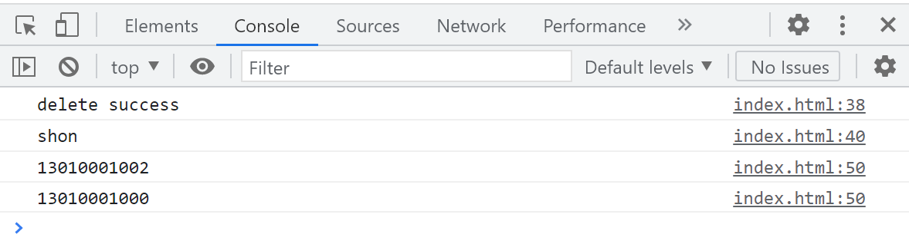

# 存储-性能-SEO

[toc]

## 什么是在线和离线事件 ？

navigator.online 被用来标识当前的网络状态， true 为连通， false 为离线

- 当 navigator.online 从 false 到 true ，触发 online 在线事件
- 当 navigator.online 从 true 到 false ，触发 offline 离线事件

早期浏览器不同版本，对离线的标准实现存在差异，如有的浏览器存在脱机模式，被认为是在线状态，从 Firefox 41，IE 9，Chrome 14 和 Safari 5 起，绝大多数浏览器实现趋于一致，该状态和相应的事件都与真实网络状态相关

由于不同网站，域名解析，服务器及网关、应用防火墙等的存在，该属性及在线事件，不能表示用户可以访问某网站。实际的可访问性，仍然依赖发送到指定网站的请求来判断，对于跨域的情况，可以请求图片，CSS 或 JS，测试连通性。如果是插件，可以在 manifest.json 的 host_permissions 中添加需要跨域的网站主机头

```js
/**在线事件 */
window.addEventListener('online',  () => console.log('online'))
/** 离线事件*/
window.addEventListener('offline',  () => console.log('offline'))
```

## 什么是 [Service Workers](https://developer.mozilla.org/zh-CN/docs/Web/API/Service_Worker_API)？

- Web 应用程序、浏览器与网络之间的代理服务器
- 拦截网络请求，并根据网络采取适当动作，更新服务器资源
- 完全异步，不阻塞 JavaScript 线程，不能访问 DOM
- 提供入口以推送通知和访问后台同步 API
- 用于离线缓存，后台数据同步，响应来自其它源的资源请求，集中接收成本高的数据更新

## 什么是持久化存储 ？

持久化是将数据从瞬时状态转换为持久状态，通常是将内存中的数据模型转换为存储模型，根据持久化的作用域，持久化分为：

- 会话持久化：在网页会话或浏览器标签处于活动状态时，保留数据。
  - 例如：Session Storage API
    - 会话在浏览器打开期间保持，不受重新加载或恢复页面的影响
    - 在新标签或窗口打开页面时，会复制顶级浏览会话的上下文作为新会话的上下文
    - 打开多个相同 URL 的 Tabs 页面，创建各自 sessionStorage
    - 关闭浏览期窗口或标签，清除 sessionStorage
    - 缓存上限值一般为 5MB / 域名 左右
- 设备持久化：在跨会话、浏览器标签和窗口，在设备中保留数据
  - 例如：Cache API
    - Cache 接口以 URL 作为键名，将 Response 作为键值缓存
    - 缓存长期有效，需开发者手动设计清理逻辑
    - 缓存上限值按域名限制，浏览器自动管理，必要时，将全部删除某个域名下的缓存
- 全局持久化：跨会话、浏览器标签和窗口，跨设备，在云端保存设备
  - 例如：Web Extension Storage API 的 storage.sync 方法
    - 用户数据可以与浏览器账号自动同步
    - 即使使用隐身模式，用数据也可以保留
    - 异步读写
    - 存储对象，不需要转换为字符串

## 什么是 IndexedDB API ?

IndexedDB 是事务型数据库系统，是基于 JavaScript 的面向对象数据库，通过索引实现对数据的高性能搜索。客户端处于离线状态，可以访问 IndexedDB 存储的数据，其用于在客户端持久化存储大量的结构化数据，支持[结构化克隆算法](https://developer.mozilla.org/zh-CN/docs/Web/API/Web_Workers_API/Structured_clone_algorithm)支持的类型：

- 原始类型（不含 Symbols）
- Boolean 对象
- String 对象
- Date 对象
- RegExp 对象（不保留 lastIndex 字段）
- Blob 对象（二进制文件对象）
- File 对象
- FileList 对象
- ImageData 对象
- Array 对象
- ArrayBuffer 对象（通用、固定长度的二进制数据缓冲区）
- TypedArray 对象 （类型化数组）
- Object 对象 （包括对象字面量）
- Set 对象
- Map 对象

不支持类型：

- Error 对象
- Funtion 对象
- DOM 节点
- 原型链上的属性和方法
  
使用 IndexDB 创建数据仓库，添加索引，通过事务，增、删、查、改的代码示例：

```js
const datas = [
  { name: 'shon', phone: '13010001000' },
  { name: 'shon', phone: '13010001001' },
  { name: 'carl', phone: '13010001002' },
]
const request = indexedDB.open('leetcodeDB', 1) // 创建名为 leetcodeDB 数据库，版本号为 1
request.onerror = e => { // 数据库错误回调，底层如事务错误，也会冒泡到这里
  console.log(e.target.error) // 输出错误
}
request.onsuccess = e => { // 数据库打开 / 创建成功时回调
  const db = e.target.result // 保存数据库接口
  run(db)
}
request.onupgradeneeded = e => { // 数据库更新时回调
  const db = e.target.result // 保存数据库接口
  const store = db.createObjectStore('member', { keyPath: 'phone' }) // 创建会员仓库，使用手机号作为 keyPath （类似关系型数据库的主键）
  store.createIndex('name', 'name', { unique: false }) // 将名称作为非唯一索引
  store.transaction.oncomplete = () => run(db)
}
const run = db => {
  const transaction = db.transaction('member', 'readwrite')
  const memberStore = transaction.objectStore('member')
  /** 增 */
  datas.forEach(data => memberStore.put(data)) // 将数据逐条插入数据仓库
  transaction.oncomplete = () => {
    const memberStore = db.transaction('member', 'readwrite').objectStore('member')
    /** 删 */
    memberStore.delete('13010001001').onsuccess = () => {console.log('delete success')}
    /** 查 */
    memberStore.get('13010001000').onsuccess = e => console.log(e.target.result.name) // 输出：shon
    /** 改 */
    memberStore.get('13010001002').onsuccess = e => {
      e.target.result.name = 'shon' // 修改名称 carl -> shon
      memberStore.put(e.target.result).onsuccess = () => {
        /** 搜索 */
        const index = memberStore.index('name') // name 之前已经添加索引
        index.openCursor(IDBKeyRange.only('shon'), 'prev').onsuccess = e => { // 倒序搜索名称 shon
          const cursor = e.target.result
          if (cursor) {
            console.log(cursor.value.phone) // 依次输出手机号：13010001002 13010001000
            cursor.continue()
          }
        }
      }
    }
  }
}
```

运行结果：



## 什么是 Web Storage API ?

Web Storage API 是浏览器提供用来替代 Cookie 更直观，容量更大，更节省请求带宽的在客户端存取键值对类型数据的接口

Web Storage API 提供两种机制

- sessionStorage 存储区域根据域名隔离，该区域仅在页面会话期间可用。在浏览器实现了 WindowSessionStorage 对象挂载到 Window 对象的 sessionStorage 属性
- localStorage 存储区域根据根据域名隔离，除非用户操作，不会主动清空。在浏览器实现了 WindowLocalStorage 对象挂载到 Window 对象的 localStorage 属性

Web Storage API 提供的存储上限值：

- 现代浏览器一般是 5M 左右
- Firefox 45 起，浏览器崩溃或重启时，上限将限制为 10 M
- 手机QQ、手机QQ浏览器、微信一般是 2M - 5M
- iOS 5.1 起，Safari 移动版将 localStorage 数据存储在缓存文件夹，空间不足时会偶尔清理

Web Storage API 提供 1 属性和 5 方法

属性

- .length 表示存储在 Storage 对象中的数据项的数量

方法

- .key(key) 返回存储对象中第 key 项的键名，key 即索引，顺序由客户端实现
- .getItem(keyName) 返回存储对象中键名为 keyName 对应的值
- .setItem(keyName, keyValue) 创建或更新存储对象中键名为 keyName 的值为 keyValue
- .removeItem(keyName) 从存储对象中删除键名为 keyName 的数据项，如果该键名不存在，则什么都不做
- .clear() 清空存储对象中的所有键名及其对应的数据项

## 什么是 Cache API?

Cache API 以 URL 为键名，Response 为键值，为请求和响应提供缓存

- Cache API 可以在浏览器 window 下使用，也可以配合 Service worker 使用
- Cache API 存储的数据无法自动过期，开发者需要自行设计过期的逻辑
- Cache API 存储上限值按域名限制，浏览器自动管理，必要时将全部删除某个域名下的缓存
- Cache API 使用前，需要通过 CacheStorage API 返回 resolve 为 Cache 对象的 Promise
  - Caches.open(cacheName) 打开，若不存在则创建指定 cacheName 的 Cache，Cache 作为返回 Promise 的 resolve
  - Caches.has(cacheName) 检查指定 cacheName 的 Cache 是否存在，是否存在的布尔值作为返回 Promise 的 resolve
  - Caches.match(request, options) 在全局 Caches 按创建顺序查找第一个匹配 request URL 的 response 作为返回 Promise 的 resolve
  - Caches.delete(cacheName) 查找指定 cacheName 的 Cache
    - 找到，删除 Cache，返回 true 作为返回 Promise 的 resolve
    - 找不到，返回 false 作为返回 Promise 的 resolve
  - Cache.keys() 在全局 Caches 按创建顺序返回所有 Cache 对象的 CacheName 数组作为返回 Promise 的 resolve
- Cache API 提供的方法包括
- Cache.match(request, options) 按添加顺序查找第一个匹配请求 request URL 的响应 response 作为返回 Promise 的 resolve
  - options 选项
    - ignoreSearch 是否忽略查询字符串，默认值 false
    - ignoreMethod 是否忽略方法 （GET / HEAD），默认值 false
    - ignoreVary 是否忽略 Vary 头，默认值 false
- Cache.matchAll(request, options) 匹配请求 request URL 的响应 response 数组作为返回 Promise 的 resolve
  - options 选项
    - ignoreSearch 是否忽略查询字符串，默认值 false
    - ignoreMethod 是否忽略方法 （GET / HEAD），默认值 false
    - ignoreVary 是否忽略 Vary 头，默认值 false
- Cache.add(request) 请求request URL，检查 response.status
  - 等于 200，以 URL 为键名，响应 response 为键值，添加到 Cache
  - 不等于 200 不添加
  - 无需等待响应体流式传输完成
  - 仅在 GET 请求可用
  - undefined 作为返回 Promise 的 resolve
- Cache.addAll(requests) 请求 requests URL 数组，检查 response.status
  - 等于 200，以每个 URL 为键名，响应 response 为键值，添加到 Cache
  - 不等于 200 不添加
  - 无需等待响应体流式传输完成
  - 仅在 GET 请求可用
  - undefined 作为返回 Promise 的 resolve
- Cache.put(request, response)
  - 以 request URL 为键名，指定 response 为键值，添加到 Cache
  - 可以不检查 response.status
  - 无需等待响应体流式传输完成
  - 仅在 GET 请求可用
  - undefined 作为返回 Promise 的 resolve
- Cache.delete(request, { options })
  - 以 request URL 为键名，查找 Cache
    - 找到，删除，返回 true 作为返回 Promise 的 resolve
    - 找不到，返回false 作为返回 Promise 的 resolve
  - options 选项
    - ignoreSearch 是否忽略查询字符串，默认值 false
    - ignoreMethod 是否忽略方法 （GET / HEAD），默认值 false
    - ignoreVary 是否忽略 Vary 头，默认值 false
- Cache.keys(request, options)
  - 以 request URL 为键名 或者 不传查找全部，查找 Cache
  - Cache 数组作为返回 Promise 的 resolve

## 对比 Cookie、LocalStorage、SessionStorage、Session、Toke

|项目|Cookie|LocalStorage|Session|SessionStorage|Token|
|:---|:---|:---|:---|:---|:---|
|保存位置|客户端|客户段|服务端|客户端|客户端cookie/WebStorage/表单等|
|生命周期|expires前有效|不清空缓存一直有效|默认20分钟，可更改；清空cookies或者更改传参，影响session|会话期间有效|根据存储位置决定|
|存储大小|一般4kb|一般5mb|不限制|一般5mb|根据存储位置决定|
|数据类型|字符串|字符串|字符串、数组、对象，序列以后字符串存储|字符串|字符串|
|特点|请求头 cookie ，同域名每次请求都附加；响应头 set-cookie 设置 cookie|||||
|组成|||||uid用户身份标识 time时间戳 sign签名 其他参数|

### JWT- JSON Web Token

- 特点

- 将部分用户信息存储本地，避免重复查询数据库
- 组成

- Header（头部）
  - alg 表示签名的算法，默认是 HMAC SHA256 (HS256)
  - typ 表示令牌的类型，JWT
- Payload（负载）
  - 7个官方字段
    - jti 编号
    - iss 签发人
    - sub 主题
    - aud 受众
    - exp 过期时间
    - nbf 生效时间
    - iat 签发时间
  - 私有字段
    - name 姓名
    - admin 是否管理员
- Signature（签名）
  - secret 密钥
  - 使用指定 alg 签名算法，生成签名
    - HMAC SHA256(btoa(Header) + '.' + btoa(Payload), secret)
- 算出签名

## JavaScript [垃圾回收机制](https://developer.mozilla.org/zh-CN/docs/Web/JavaScript/Memory_Management)

内存分配回收期是自动的，垃圾回收器定时找出不再使用的数据，释放内存空间

两种检测回收模式

- 引用计数：清除没有任何引用只想的数据。无法处理循环引用。IE6使用
- 标记清除：标记可达数据，清除不可达数据。可处理循环引用。现代浏览器广泛使用
  - 从根出发：包括 全局变量、本地函数的局部变量、参数、调用链上其它函数的局部变量和函数等
  - 标记相连的对象为可达和访问过
  - 直到引用链上没有未访问过的对象为止
  - 删除没有被标记过，即不可达对象

- 标记清除的优化：标记清除存在 内存不连续，回收效率低，偶尔卡顿 的缺点
  - 只在CPU空间时进行
  - 分代回收：
    - 新生代：存活时间短，新生或经过一次垃圾回收的对象
    - 复制：复制 From 的可达对象 到 To 空间，释放 不可达对象
      - 晋升：复制时，To 空间使用超过 25%，晋升到 老生代
    - 交换：交换 From 和 To 空间
  - 老生代：存活时间长，经过一次被晋升或多次垃圾回收的对象
    - 标记清除
    标记整理：清除阶段先整理，将可达对象连续放置一起，再释放之外的内存
    - 增量标记：用增量标记代替全暂停，在回收间歇执行应用逻辑，避免卡顿

## 详解标记整理算法

- 标记完成
- 存活对象向内存空间一端移动
- 移动完成，清理掉边界外的所有内存

## 前端常见的内存溢出途径，如何避免？

占用内存且无法被垃圾回收机制回收对象，容易导致内存溢出（泄漏），让应用程序占用本应回收或不需要占用的内存

- 意外的全局变量：全局变量是标记清除中的「根」，除非定义为空 或 重新分配，不可回收
  - 非严格模式下，没有使用 var let const 声明的变量
  - 挂载在 this 下的属性
  - 避免：尽量不使用全局变量，在 JavaScript 头部使用严格模式
- 未清除的计时器
  - setInterval 自身及其回调函数内的对象，即使不被引用，也需要计时器停止才能清除
    - 避免：使用 requestAnimationFrame / setTimeout + 递归 代替 setInterval，并设置边界
- 删除不完全的对象
  - addEventListener 监听的对象已不可达，但监听没有移除。现代浏览器会自动移除
  - JS 中引用了 DOM 对象，对象已从 DOM Tree 中移除，但 JS 中依旧保持引用
  - 避免：
    - 移除对象前，移除监听。需大量监听对象，使用事件代理监听父元素
    - 移除 DOM 后，设置引用该 DOM 的变量为空
- 闭包中未使用函数引用了可从根访问的父级变量

  ```js
  var global = 0
  function closure () {
    let fromGlobal = global // 引用全局变量 global
    function unused () { // 闭包内不使用的函数
      if (fromGlobal) return // 引用父级变量 fromGlobal，导致 unused 占用内存
    }
    global = {} // 每次调用闭包 global 都会重新赋值
    /**避免**/
    fromGlobal = null
    closure()
  }
  ```

## 如何诊断前端内存泄漏？

Chrome浏览器DevTools

- 进入 Chrome 浏览器，打开要分析的网页和开发者工具
  - 切换到 Perfomance 面板
  - 勾选 Memory 选项
  - 点击圆圈录制按钮
  - 录制端一段时间，停止
  - 观察 JS Heap、Documents、Nodes、Listeners、GPU Memory 的数量是否有异常增长
- 发现异常增长，切换到 Memory 面板
  - 录制一个堆内存快照
  - 在页面上执行可能发生内存泄漏的操作
  - 再录制一个堆内存快照
  - 重复执行可能发生内存泄漏的操作
  - 最后录制一个堆内存快照
  - 选择最后一个堆内存快照，在右侧下拉菜单，选择 Objects allocated between snapshots 1 and 2
  - 通过对比，找到新生成或者没有释放的对象，点击可以看到堆栈信息，并定位其所在代码的位置

## 前端中有哪些 SEO 优化手段？

### 文字

- 字号 14px 以上，16px 为宜，避免小于 12px，有行距、换行和段落
- 避免使用 visibility:hidden，display: none, 绝对定位，与背景相同颜色，堆砌关键词，隐藏主要内容

### 图片

- Logo 的 DIV 中写关键词，设置 text-ident 为负数隐藏
- 图片添加 width 和 height，避免读取元数据，再重排
- 图片添加 alt，描述图片内容，便于搜索引擎蜘蛛理解，提升可访问性
- 主要图片与内容相关，不要过长或过窄，正方形为宜
- 主要图片设置 src 属性，避免全部图片都使用懒加载
- 图片可以点击放大，多张图片间可以切换

### 适配

- 独立 H5 网站
  - H5移动版与PC版域名不同，移动版子域名，推荐使用 m.x.com 等移动网站常用域名
  - 向搜索引擎提交适配规则：PC版和H5移动版组成一一对应的URL对或正则匹配关系
  - 不同域名，使用不同蜘蛛抓取
- 代码适配
  - H5 移动版和PC版域名相同，返回代码不同
  - 后端根据 User-Agent，返回不同的代码
  - 添加响应头：Vary: User-agent
  - 同一URL，蜘蛛应使用不同UA或不同蜘蛛多次抓取
- 自适应
  - H5 移动版和PC版 域名相同，返回代码相同
  - 前端通过相对单位、媒体查询、srcset 实现响应式或自适应布局
  - 同一URL，蜘蛛可以只抓取一次

### SSR：Server Side Render 服务端渲染
