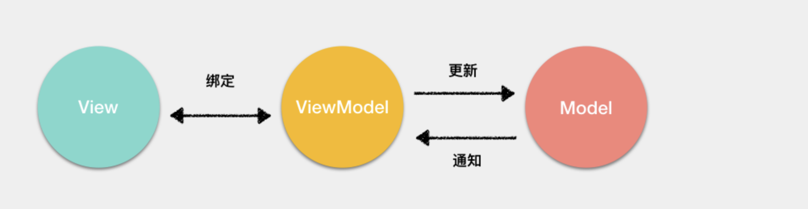

# MVVM_VDOM_前端路由

[toc]

## 什么是MVVM，与MVC区别？

首先，view就是用户看到的视图，model就是本地数据和数据库中的数据

传统的MVC架构通常是使用控制器更新模型，视图从模型中获取数据去渲染。当用户有输入时，会通过控制器去更新模型，并且通知视图进行更新。

缺点是controller承担的责任较大，代码臃肿，不利于维护

在 MVVM 架构中，引入了 ViewModel 的概念。ViewModel 只关心数据和业务的处理，不关心 View 如何处理数据，在这种情况下，View和 Model 都可以独立出来，任何一方改变了也不一定需要改变另一方，并且可以将一些可复用的逻辑放在一个 ViewModel 中，让多个 View 复用这个 ViewModel。
