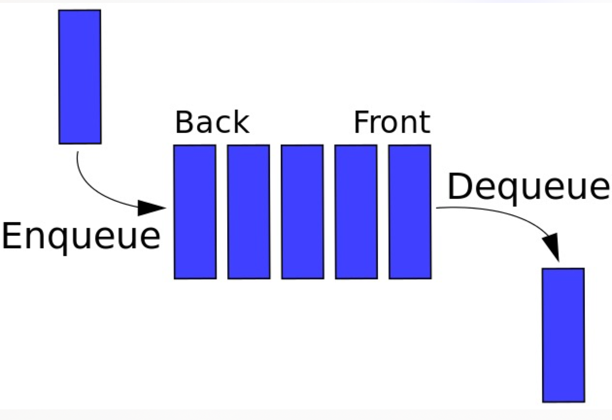

# 常见数据结构

[toc]

## 时间复杂度

在计算机科学中，算法的时间复杂度（Time complexity）是一个函数，它定性描述该算法的运行时间。这是一个代表算法输入值的字符串的长度的函数。时间复杂度常用大O符号表述，不包括这个函数的低阶项和首项系数。使用这种方式时，时间复杂度可被称为是渐近的，亦即考察输入值大小趋近无穷时的情况。

## 栈 stack

线性结构；只能在某一端添加或者删除数据，遵循先进后出的原则

应用

- 匹配括号

## 队列 queue

线性结构；特点是在一端添加数据，在另一端删除数据，遵循先进先出的原则

- 单链队列：出队的时间复杂度O(n)
- 循环队列：出队的时间复杂度O(1)

## 链表 nodeList

线性结构；递归结构；链表结构可以充分利用计算机内存空间，实现灵活的内存动态管理。但是链表失去了数组随机读取的优点，同时链表由于增加了结点的指针域，空间开销比较大。

## 树 tree

### 二叉树

二叉树拥有一个根节点，每个节点至多拥有两个子节点：左节点和右节点。树的最根部节点称为叶节点，当一棵树的叶节点为满时，该树可以称之为满二叉树。

### 二叉搜索树

二分搜索树也是二叉树，拥有二叉树的特性。但是区别在于二分搜索树每个节点的值都比他的左子树的值大，比右子树的值小。

这种存储方式很适合于数据搜索。

### 堆 heap

任意节点大于(或小于)它的子节点

完全二叉树

最大堆和最小堆
