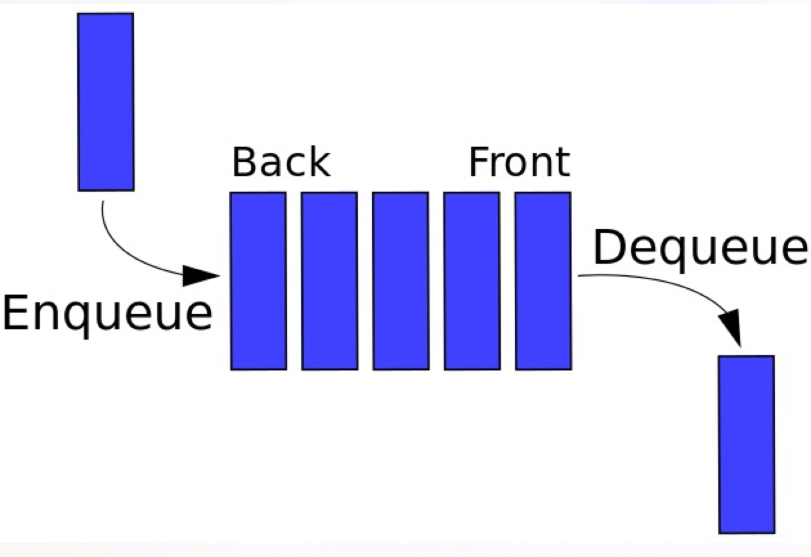

# 算法

[toc]

## 时间复杂度


O(1)

```js
let i = 1; i +=1
```

O(n)

```js
// for
for(let i = 0; i <n; i++){
  console.log(i)
}
```

O(1) + O(n) = O(n)

O(n) * O(n) = O(n^2)

O(logN)

```js
let i = 1;
while(i < n){
  console.log(i);
  i *= 2
}
```

### 空间复杂度

O(1)

```js
let i = 1;
```

O(n)

```js
let i = [1, 2, 3]
```

O(n^2)

```js
//矩阵
const matrix = [];
for(let i = 0; i < n; i ++){
  martix.push([])
  for(let j = 0; j < n; j ++){
    martix[i].push(j)
  }
}
```

## stack 栈

线性结构；只能在某一端添加或者删除数据，遵循“先进后出, 后进先出”的原则

应用场景

- 十进制转换二进制
- 判断字符串括号是否有效闭合(leetcode 20)(./stack/01-stack.js)
- 函数调用堆栈(vscode 调试)

js中利用Array实现栈的功能

- push进栈
- pop出栈

## queue 队列



线性结构；特点是在一端添加数据，在另一端删除数据，遵循先进先出的原则

- 单链队列：出队的时间复杂度O(n)
- 循环队列：出队的时间复杂度O(1)

js中利用Array实现queue

- shift出队
- push入队

应用场景

- js异步中的任务队列 Event Loop
- 计算最近请求次数
- 所有需要先进先出的场景(leetcode 933)(./queue/02-recentCounter.js)

## linkedList 链表


线性结构；递归结构；链表结构可以充分利用计算机内存空间，实现灵活的内存动态管理。但是链表失去了数组随机读取的优点，同时链表由于增加了结点的指针域，空间开销比较大。

js中利用object实现链表

与数组的区别

- 数组增删尾元素需要移动元素
- 链表不需要

应用场景

- 删除链表中的节点(leetcode 237)(./linkedList/deleteNode.js)
- js中的原型链
  - object->Object.prototype->null
  - function->Function.prototype->Object.prototype->null
  - array->Array.prototype->Object.prototype->null
  - `A instanceof B` A沿着原型链能找到B.prototype
- 使用链表指针也可以获取JSON的节点值

## set 集合

**无序**且**唯一**的数据结构

应用场景

- 数组去重
- 判断元素是否在集合中
- 求交集

方法及属性

- size
- add()
- has()
- delete()
- clear()

## map 字典

常用方法及属性

- size
- set 增
- delete 删
- clear 清空
- get 查
- has 查

## tree 树

树是一种分层的数据的抽象模型

前端常见的书结构：DOM树、级联选择、树形控件

object和array构建树结构

常用操作

- 深度优先遍历
- 广度优先遍历
- 先中后序遍历

### 深度优先遍历

尽可能深的搜索树的分支

- 访问根节点。
- 对根节点children挨个进行深度优先遍历(递归)

### 广度优先遍历

先访问离根节点最近的节点

- 新建一个队列，把根节点入队
- 把对头出队并访问
- 把队头的children挨个入队
- 重复第二三步，直到队列为空
  
## binary tree 二叉树

### 先序遍历

- 访问根节点
- 对根结点的左子树进行先序遍历
- 对根结点的右子树进行先序遍历

### 中序遍历

- 先对根节点的左子树进行中序遍历
- 访问根节点
- 对根节点的右子树进行中序遍历

### 后序遍历

- 先对根节点的左子树进行后序遍历
- 对根节点的右子树进行后序遍历
- 访问根节点

## graph 图

网络结构的抽象模型，是一组由边连接的节点，如航班、公里

js使用Object和Array实现graph

图的表示法：邻接表和邻接矩阵

图的常用操作：

- 深度优先遍历
  - 访问根节点。
  - 对根节点的没访问过的相邻节点挨个进行深度优先遍历
- 广度优先遍历
  - 新建一个队列，根节点入队
  - 队头出队并访问
  - 把队头的没访问过的相邻节点入队
  - 重复二、三步，直到队列为空

## heap 堆

堆是一种**完全二叉树**

所有节点都大于等于或者小于等于它的子节点

JS中通常使用数组表示堆

左侧子节点的位置是`2*index+1`

右侧子节点的位置`2*index+2`

父节点的位置的`(index-1)/2`

引用场景

- 高效快速地找出最大值和最小值，时间复杂度O(1)
- 找出第K个最大最(小)元素

## 排序

数组的sort

- 冒泡排序
- 选择排序
- 插入排序
- 归并排序
  - 分而治之的思想
    - 分：把数组分成两半，再递归地对子数组进行分操作，知道分成一个个单独的数
    - 合：把两个数合并为有序数组，再对有序数组进行合并，直到全部子数组合并为一个完整数组
      - 新建一个空数组res，用于存放最终排序的数组
      - 比较两个有序数组的头部，较小者出队并推入res中
      - 如果两个数组还有值，就重复第二步
- 快速排序
  - 分区：从数组中任意选择一个基准，所有比基准小的元素放在基准前面，所有比基准大的元素放在基准后面
  - 递归：递归的对基准前后的子数组进行分区

## 搜索

indexOf

- 顺序搜索
- 二分搜索

## 算法设计

### Divide and Conquer 分而治之

分-解(递归)-合

子问题是独立的

应用场景：

- 归并排序
- 快速排序
- 二分搜索
- 翻转二叉树

### Dynamic programming 动态规划

将一个问题分解成**相互重叠**的子问题，通过反复求解子问题来解决原来的问题

### Greedy Algorithm 贪心算法

期盼通过每个阶段的局部最优选择，从而达到全局的最优

结果不一定最优

### Back Trackng 回溯算法

- 全排列
- 子集

### Exhaustive 穷举
